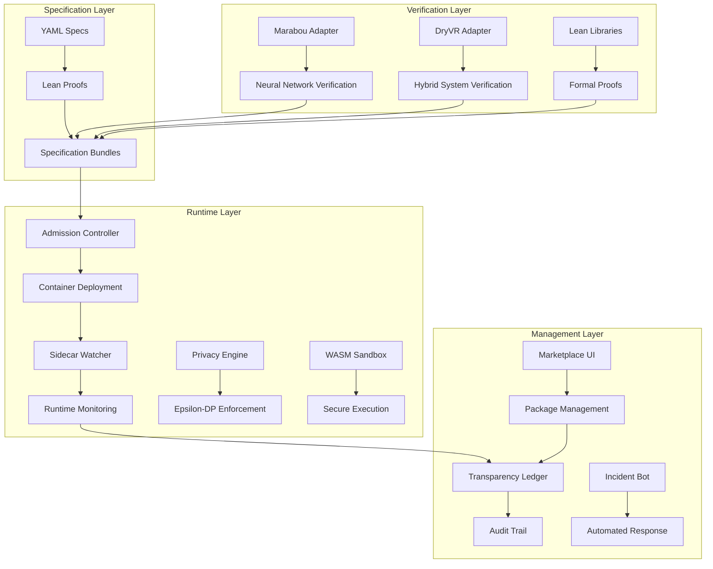

# Provability Fabric - Comprehensive Project Documentation

## Table of Contents

1. [Project Overview](#project-overview)
2. [Architecture Overview](#architecture-overview)
3. [Core Components](#core-components)
4. [Runtime Components](#runtime-components)
5. [Specification System](#specification-system)
6. [Verification Adapters](#verification-adapters)
7. [Marketplace & UI](#marketplace--ui)
8. [Testing & Quality Assurance](#testing--quality-assurance)
9. [Deployment & Operations](#deployment--operations)
10. [Security & Compliance](#security--compliance)
11. [Development Workflow](#development-workflow)
12. [Troubleshooting](#troubleshooting)

---

## Project Overview

**Provability Fabric** is an open-source framework that binds every AI agent container image to a machine-checkable Lean proof (Proof-of-Behaviour), ensuring provable behavioral guarantees through formal verification. The project addresses the critical need for trust in AI systems by providing mathematical guarantees about agent behavior rather than relying on empirical testing alone.

### Key Principles

1. **Formal Verification**: Every agent behavior is mathematically proven using Lean 4 theorem prover
2. **Runtime Enforcement**: Sidecar containers monitor execution in real-time
3. **Cryptographic Binding**: Container images are cryptographically bound to their proofs
4. **Transparency**: All specifications and proofs are publicly verifiable
5. **Composability**: Verified components can be safely composed together

### Problem Statement

Traditional AI systems suffer from:
- **Opacity**: Black-box behavior that cannot be reasoned about
- **Unpredictability**: Behavior that changes unexpectedly
- **Safety Concerns**: No guarantees about harmful actions
- **Compliance Issues**: Difficulty proving regulatory compliance
- **Trust Gaps**: Reliance on empirical testing alone

### Solution Approach

Provability Fabric provides:
- **Specification-Driven Development**: YAML + Lean specifications define behavior
- **Formal Proofs**: Machine-checkable mathematical proofs of safety properties
- **Runtime Monitoring**: Real-time enforcement of behavioral constraints
- **Cryptographic Verification**: Tamper-proof binding of code to proofs
- **Transparency Ledger**: Immutable record of all specifications and verifications

---

## Architecture Overview

The Provability Fabric architecture consists of four main layers:



### Data Flow

1. **Specification Creation**: Developers create YAML specifications and Lean proofs
2. **Verification**: Adapters verify neural networks and hybrid systems
3. **Bundle Creation**: Specifications are packaged into signed bundles
4. **Deployment**: Admission controller validates bundles before deployment
5. **Runtime Monitoring**: Sidecar containers monitor execution
6. **Audit Trail**: All activities are recorded in the transparency ledger

---

## Core Components

### 1. Core CLI (`pf`)

The main command-line interface for managing agent specifications.

**Location**: `core/cli/pf/`

**Key Features**:
- Initialize new agent specifications
- Lint and validate proofs
- Sign specification bundles
- Check traceability mappings
- Generate documentation

**Usage Examples**:
```bash
# Initialize a new agent
pf init my-agent

# Validate a specification bundle
pf validate bundle.yaml

# Sign a bundle with cryptographic signature
pf sign bundle.yaml --key private.key

# Generate documentation
pf doc bundle.yaml --output docs/
```

### 2. Lean Libraries

Core formal verification libraries written in Lean 4.

**Location**: `core/lean-libs/`

**Key Files**:
- `ActionDSL.lean`: Action definitions and basic properties
- `Budget.lean`: Budget management and spending constraints
- `Capability.lean`: Capability-based security model
- `Privacy.lean`: Differential privacy accounting
- `Redaction.lean`: PII redaction and data protection
- `Sandbox.lean`: WASM sandbox security properties

**Example from ActionDSL.lean**:
```lean
/-- Basic Action type for simple agents -/
inductive Action where
  | SendEmail (score : Nat)
  | LogSpend (usd : Nat)

/-- Check if a list of actions respects budget constraints -/
def budget_ok : List Action → Prop
  | [] => True
  | actions => total_spend actions ≤ budget_limit

/-- Theorem: budget_ok is prefix-closed -/
theorem thm_budget_ok_prefix_closed :
  ∀ (tr₁ tr₂ : List Action), 
  budget_ok (tr₁ ++ tr₂) → budget_ok tr₁
```

### 3. Specification Templates

Standardized templates for creating new agent specifications.

**Location**: `spec-templates/v1/`

**Structure**:
```
spec-templates/v1/
├── spec.yaml          # YAML specification
├── spec.md           # Human-readable documentation
└── proofs/
    ├── lakefile.lean # Lean build configuration
    ├── lean-toolchain
    └── Spec.lean     # Formal specification
```

**Example spec.yaml**:
```yaml
metadata:
  name: "my-agent"
  version: "1.0.0"
  description: "A verified AI agent"

specification:
  budget_limit: 100.0
  spam_score_limit: 0.8
  privacy_epsilon: 1.0
  privacy_delta: 1e-5

constraints:
  - type: "budget"
    limit: 100.0
  - type: "spam"
    limit: 0.8
  - type: "privacy"
    epsilon: 1.0
    delta: 1e-5

tools:
  - name: "SendEmail"
    allowed: true
  - name: "LogSpend"
    allowed: true
  - name: "NetworkCall"
    allowed: false
```

---

## Runtime Components

### 1. Sidecar Watcher

Real-time runtime monitoring component written in Rust.

**Location**: `runtime/sidecar-watcher/`

**Key Features**:
- Monitors container logs in real-time
- Enforces budget and spam constraints
- Tracks privacy budget consumption
- Reports violations to the ledger
- Provides Prometheus metrics

**Core Functionality**:
```rust
struct Watcher {
    metrics: Metrics,
    assumption_monitor: AssumptionMonitor,
    epsilon_guard: EpsilonGuard,
    spec_sig: String,
    budget_limit: f64,
    spam_score_limit: f64,
    running_spend: f64,
    tenant_id: String,
    ledger_url: String,
}
```

**Monitoring Capabilities**:
- **Budget Enforcement**: Tracks spending and enforces limits
- **Spam Detection**: Monitors spam scores and blocks violations
- **Privacy Accounting**: Tracks ε-differential privacy budget
- **Assumption Monitoring**: Validates runtime assumptions
- **Metrics Collection**: Prometheus metrics for observability

### 2. Admission Controller

Kubernetes webhook that validates specifications before deployment.

**Location**: `runtime/admission-controller/`

**Key Features**:
- Validates specification bundles before deployment
- Checks cryptographic signatures
- Verifies proof completeness
- Enforces security policies
- Integrates with OPA (Open Policy Agent)

**Validation Process**:
1. **Signature Verification**: Validates cryptographic signatures
2. **Proof Completeness**: Ensures all required proofs are present
3. **Constraint Validation**: Verifies constraint definitions
4. **Tool Allowlist**: Checks tool permissions
5. **Security Policies**: Applies organizational security policies

### 3. Transparency Ledger

GraphQL service that maintains an immutable audit trail.

**Location**: `runtime/ledger/`

**Key Features**:
- Immutable record of all specifications
- Cryptographic verification status
- Runtime violation tracking
- Multi-tenant support
- GraphQL API for queries

**Data Model**:
```typescript
interface Specification {
  id: string;
  name: string;
  version: string;
  signature: string;
  proofs: Proof[];
  constraints: Constraint[];
  verification_status: VerificationStatus;
  created_at: Date;
  updated_at: Date;
}

interface RuntimeEvent {
  tenant_id: string;
  specification_id: string;
  event_type: EventType;
  violation_details?: ViolationDetails;
  timestamp: Date;
}
```

### 4. Privacy Engine

Epsilon-differential privacy enforcement component.

**Location**: `runtime/privacy/`

**Key Features**:
- ε-differential privacy accounting
- Privacy budget tracking
- Noise injection mechanisms
- Privacy violation detection
- Integration with sidecar watcher

**Privacy Model**:
```rust
pub struct EpsilonGuard {
    epsilon_budget: f64,
    delta_budget: f64,
    privacy_metrics: PrivacyMetrics,
}

impl EpsilonGuard {
    pub fn check_privacy_budget(&mut self, epsilon: f64, delta: f64) -> bool {
        if epsilon <= self.epsilon_budget && delta <= self.delta_budget {
            self.epsilon_budget -= epsilon;
            self.delta_budget -= delta;
            true
        } else {
            false
        }
    }
}
```

### 5. WASM Sandbox

Secure WebAssembly execution environment.

**Location**: `runtime/wasm-sandbox/`

**Key Features**:
- Isolated execution environment
- Syscall filtering
- Memory isolation
- Network access control
- Capability-based security

**Security Properties**:
- **Non-interference**: Sandboxed code cannot access host resources
- **Syscall Filtering**: Only allowed system calls are permitted
- **Memory Isolation**: Sandbox memory is isolated from host
- **Network Control**: Network access is strictly controlled

### 6. Incident Bot

Automated incident response and rollback system.

**Location**: `runtime/incident-bot/`

**Key Features**:
- Automated violation detection
- Incident classification
- Rollback orchestration
- Alert management
- Integration with monitoring systems

**Incident Response Flow**:
1. **Detection**: Monitors for constraint violations
2. **Classification**: Categorizes incident severity
3. **Response**: Executes automated response actions
4. **Rollback**: Orchestrates service rollback if needed
5. **Notification**: Alerts relevant stakeholders

---

## Specification System

### 1. Specification Bundles

Specification bundles are the core unit of deployment in Provability Fabric.

**Structure**:
```
bundle/
├── spec.yaml          # YAML specification
├── spec.md           # Documentation
├── proofs/
│   ├── lakefile.lean # Lean build config
│   ├── lean-toolchain
│   └── Spec.lean     # Formal specification
└── metadata.json     # Bundle metadata
```

**Bundle Validation**:
- **Cryptographic Signature**: Ensures authenticity
- **Proof Completeness**: All required proofs present
- **Constraint Validation**: Constraints are well-formed
- **Tool Allowlist**: Tool permissions are valid
- **Version Compatibility**: Compatible with runtime

### 2. Lean Proofs

Formal specifications written in Lean 4 theorem prover.

**Key Properties**:
- **Budget Safety**: Spending never exceeds limits
- **Spam Prevention**: Spam scores remain below thresholds
- **Privacy Preservation**: ε-differential privacy maintained
- **Capability Enforcement**: Only allowed tools used
- **Composition Safety**: Properties preserved under composition

**Example Proof**:
```lean
/-- Theorem: budget_ok is prefix-closed -/
theorem thm_budget_ok_prefix_closed :
  ∀ (tr₁ tr₂ : List Action), 
  budget_ok (tr₁ ++ tr₂) → budget_ok tr₁ := by
  intro tr₁ tr₂ h_combined
  -- Proof that if combined trace is budget-safe,
  -- then any prefix is also budget-safe
  -- This ensures that stopping execution at any point
  -- maintains budget safety
```

### 3. ART Benchmarks

Automated Reasoning Test (ART) benchmarks for behavior verification.

**Location**: `bundles/art/`

**Implemented Behaviors**:
1. **budget_control**: Budget spending constraints
2. **spam_prevention**: Spam score limits
3. **privacy_compliance**: Differential privacy enforcement
4. **capability_enforcement**: Tool allowlist enforcement
5. **differential_privacy**: ε-differential privacy accounting
6. **sandbox_isolation**: WASM sandbox security
7. **composition_safety**: Property preservation under composition
8. **trace_monotonicity**: Monotonic properties of traces
9. **prefix_closure**: Prefix-closed safety properties
10. **invariant_preservation**: Invariant maintenance

**Benchmark Structure**:
```
bundles/art/<behavior-id>/
├── spec.yaml          # Behavior specification
├── proofs/
│   ├── lakefile.lean # Lean build configuration
│   ├── lean-toolchain
│   └── Spec.lean     # Formal behavior specification
└── tests/            # Test cases
```

---

## Verification Adapters

### 1. Marabou Adapter

Neural network verification using Marabou solver.

**Location**: `adapters/marabou/`

**Key Features**:
- Neural network property verification
- Linear and non-linear constraint solving
- Adversarial example generation
- Robustness verification
- Integration with Lean proofs

**Verification Process**:
1. **Network Loading**: Loads neural network model
2. **Property Specification**: Defines verification properties
3. **Constraint Encoding**: Encodes properties as constraints
4. **Solver Execution**: Runs Marabou solver
5. **Result Validation**: Validates solver results
6. **Proof Generation**: Generates Lean proofs

**Example Usage**:
```python
from marabou_adapter import MarabouAdapter

adapter = MarabouAdapter()
adapter.load_network("model.onnx")
adapter.add_property("robustness", epsilon=0.1)
result = adapter.verify()
if result.satisfied:
    print("Network satisfies robustness property")
```

### 2. DryVR Adapter

Hybrid system reachability analysis using DryVR.

**Location**: `adapters/dryvr/`

**Key Features**:
- Hybrid system verification
- Reachability analysis
- Safety property verification
- Temporal logic properties
- Integration with Lean proofs

**Verification Process**:
1. **System Modeling**: Models hybrid system dynamics
2. **Property Specification**: Defines safety properties
3. **Reachability Analysis**: Computes reachable sets
4. **Property Checking**: Verifies properties over reachable sets
5. **Proof Generation**: Generates Lean proofs

### 3. Hello World Adapter

Simple adapter for testing and demonstration.

**Location**: `adapters/hello-world/`

**Key Features**:
- Basic functionality demonstration
- Testing framework integration
- Simple property verification
- Learning curve for new users

### 4. Evil Netcall Adapter

Security testing adapter for malicious behavior detection.

**Location**: `adapters/evil-netcall/`

**Key Features**:
- Malicious behavior testing
- Security vulnerability detection
- Network call analysis
- Threat modeling
- Security validation

---

## Marketplace & UI

### 1. Marketplace API

RESTful API for package management and system monitoring.

**Location**: `marketplace/api/`

**Key Endpoints**:
- `GET /packages`: List available packages
- `GET /packages/{id}`: Get package details
- `POST /packages`: Upload new package
- `GET /packages/{id}/download`: Download package
- `GET /metrics`: System metrics
- `GET /health`: Health check

**API Features**:
- **Package Management**: Upload, download, and manage packages
- **Search & Discovery**: Find packages by criteria
- **Version Control**: Manage package versions
- **Verification Status**: Check proof verification status
- **Usage Analytics**: Track package usage

### 2. React UI

Modern web interface for managing the Provability Fabric system.

**Location**: `marketplace/ui/`

**Key Components**:
- **Dashboard**: System overview and metrics
- **Package List**: Browse and search packages
- **Package Detail**: Detailed package information
- **Search Page**: Advanced search functionality
- **Header/Footer**: Navigation and branding

**UI Features**:
- **Real-time Updates**: Live data from marketplace API
- **Interactive Charts**: Visualize system metrics
- **Package Management**: Upload and manage packages
- **Verification Status**: Visual verification indicators
- **Responsive Design**: Works on desktop and mobile

**Technology Stack**:
- **React 18**: Modern React with hooks
- **TypeScript**: Type-safe development
- **Tailwind CSS**: Utility-first styling
- **Heroicons**: Beautiful icons
- **React Router**: Client-side routing

**Example Component**:
```typescript
interface Package {
  id: string;
  name: string;
  version: string;
  description: string;
  verification_status: VerificationStatus;
  download_count: number;
  created_at: Date;
}

const PackageList: React.FC = () => {
  const [packages, setPackages] = useState<Package[]>([]);
  const [loading, setLoading] = useState(true);

  useEffect(() => {
    fetchPackages().then(setPackages).finally(() => setLoading(false));
  }, []);

  return (
    <div className="grid grid-cols-1 md:grid-cols-2 lg:grid-cols-3 gap-6">
      {packages.map(pkg => (
        <PackageCard key={pkg.id} package={pkg} />
      ))}
    </div>
  );
};
```

---

## Testing & Quality Assurance

### 1. TRUST-FIRE Test Suite

Comprehensive test suite for validating system behavior.

**Location**: `tests/`

**Test Categories**:
- **Integration Tests**: End-to-end system validation
- **Security Tests**: Malicious behavior detection
- **Performance Tests**: Load and stress testing
- **Privacy Tests**: Differential privacy validation
- **Chaos Tests**: Failure scenario testing

**Test Execution**:
```bash
# Run complete test suite
python tests/trust_fire_orchestrator.py

# Run specific test categories
python tests/privacy/privacy_burn_down.py --tenant-id acme-beta
python tests/security/malicious_adapter_test.py
python tests/chaos/chaos_rollback_test.py
```

### 2. Lean Quality Gates

Automated quality checks for Lean proofs.

**Location**: `tools/lean_gate.py`

**Quality Gates**:
- **No Stale `sorry`**: No unproven lemmas older than 48 hours
- **Time Budgets**: Build time limits (360s total, 90s per file)
- **Proof Completeness**: All required proofs present
- **Style Guidelines**: Consistent code style

**Quality Enforcement**:
```bash
# Run quality gate checks
python tools/lean_gate.py

# Check time budgets
bash scripts/lean_time_budget.sh
```

### 3. Property-Based Testing

Automated property testing using ProofBench.

**Location**: `ProofBench.lean`

**Features**:
- **Trace Generation**: Generate test traces automatically
- **Property Testing**: Test properties on generated traces
- **Counterexample Shrinking**: Minimize failing examples
- **Reproducible Tests**: Seeded generation for consistency

**Usage**:
```bash
# Run property-based tests
lake exe proofbench

# Test specific properties
lake exe proofbench --property budget_safety
```

### 4. ART Smoke Tests

Automated testing of ART benchmark behaviors.

**Location**: `scripts/art_runner.py`

**Test Process**:
1. **Behavior Loading**: Load ART behavior specifications
2. **Proof Verification**: Verify Lean proofs
3. **Runtime Testing**: Test runtime enforcement
4. **Performance Validation**: Check performance targets
5. **Result Reporting**: Generate test reports

**Target Metrics**:
- **Block Rate**: ≥95% of violations blocked
- **Latency**: Mean latency ≤25ms
- **Throughput**: Handle expected load
- **Accuracy**: Correct violation detection

---

## Deployment & Operations

### 1. Kubernetes Deployment

Production deployment using Kubernetes and Helm.

**Location**: `runtime/admission-controller/deploy/`

**Components**:
- **Admission Controller**: Validates deployments
- **Sidecar Watcher**: Runtime monitoring
- **Transparency Ledger**: Audit trail service
- **Incident Bot**: Automated response
- **WASM Sandbox**: Secure execution

**Deployment Process**:
1. **Bundle Validation**: Admission controller validates bundles
2. **Sidecar Injection**: Automatically injects monitoring sidecars
3. **Service Deployment**: Deploys agent containers
4. **Monitoring Setup**: Configures monitoring and alerting
5. **Health Checks**: Validates deployment health

### 2. Infrastructure as Code

Terraform configurations for cloud infrastructure.

**Location**: `ops/terraform/`

**Infrastructure Components**:
- **Compute Resources**: Kubernetes clusters
- **Storage**: Persistent storage for ledger
- **Networking**: Load balancers and network policies
- **Security**: IAM roles and security groups
- **Monitoring**: Logging and metrics infrastructure

### 3. CI/CD Pipeline

Automated testing and deployment pipeline.

**Location**: `.github/workflows/`

**Pipeline Stages**:
1. **Build**: Compile all components
2. **Test**: Run comprehensive test suite
3. **Quality Gates**: Enforce quality standards
4. **Security Scan**: Vulnerability scanning
5. **Deploy**: Automated deployment
6. **Monitor**: Post-deployment monitoring

**Key Workflows**:
- **CI**: Continuous integration testing
- **CD**: Continuous deployment
- **Security**: Security scanning and validation
- **Release**: Release management

### 4. Monitoring & Observability

Comprehensive monitoring and observability stack.

**Components**:
- **Prometheus**: Metrics collection
- **Grafana**: Visualization dashboards
- **Jaeger**: Distributed tracing
- **Alertmanager**: Alert management
- **ELK Stack**: Log aggregation

**Key Metrics**:
- **System Health**: Service availability and performance
- **Security**: Violation detection and response
- **Privacy**: Privacy budget consumption
- **Performance**: Response times and throughput
- **Business**: Package usage and adoption

---

## Security & Compliance

### 1. Security Model

Multi-layered security approach.

**Security Layers**:
1. **Cryptographic Verification**: Tamper-proof proof binding
2. **Runtime Enforcement**: Real-time constraint monitoring
3. **Capability-Based Security**: Tool allowlist enforcement
4. **Network Isolation**: Zero-trust networking
5. **Sandbox Execution**: Isolated execution environments

**Security Properties**:
- **Non-repudiation**: Cryptographic signatures prevent denial
- **Integrity**: Tamper-proof specification bundles
- **Confidentiality**: Privacy-preserving execution
- **Availability**: Resilient to attacks and failures
- **Auditability**: Complete audit trail

### 2. Compliance Framework

Comprehensive compliance support.

**Compliance Standards**:
- **SOC 2 Type II**: Security and availability controls
- **SLSA Level 3**: Supply chain security
- **GDPR**: Data protection and privacy
- **CCPA**: California privacy rights
- **HIPAA**: Healthcare data protection

**Compliance Features**:
- **Audit Logging**: Complete activity logging
- **Data Classification**: Automatic data classification
- **Privacy Controls**: Built-in privacy protection
- **Access Controls**: Role-based access control
- **Incident Response**: Automated incident handling

### 3. Threat Model

Comprehensive threat modeling and mitigation.

**Threat Categories**:
- **Supply Chain Attacks**: Mitigated by cryptographic verification
- **Runtime Attacks**: Mitigated by sidecar monitoring
- **Privacy Attacks**: Mitigated by differential privacy
- **Network Attacks**: Mitigated by network isolation
- **Social Engineering**: Mitigated by automated enforcement

**Mitigation Strategies**:
- **Defense in Depth**: Multiple security layers
- **Zero Trust**: Verify everything, trust nothing
- **Automated Response**: Immediate threat response
- **Continuous Monitoring**: Real-time threat detection
- **Regular Audits**: Periodic security assessments

---

## Development Workflow

### 1. Development Setup

Complete development environment setup.

**Prerequisites**:
- **Go 1.21+**: For CLI development
- **Python 3.8+**: For testing and scripts
- **Node.js 18+**: For UI development
- **Lean 4**: For formal proofs
- **kubectl**: For Kubernetes deployment

**Setup Commands**:
```bash
# Clone repository
git clone https://github.com/fraware/provability-fabric.git
cd provability-fabric

# Build CLI tools
cd core/cli/pf && go build -o pf.exe . && cd ../..
cd cmd/specdoc && go build -o specdoc.exe . && cd ../..

# Install Python dependencies
pip install -r tests/integration/requirements.txt
pip install -r tests/proof-fuzz/requirements.txt
pip install -r tools/compliance/requirements.txt

# Install Node.js dependencies
cd marketplace/ui && npm install && cd ../..

# Start development server
cd marketplace/ui && npm start
```

### 2. Specification Development

Process for creating new agent specifications.

**Development Steps**:
1. **Initialize Specification**: Use `pf init` to create new spec
2. **Define Constraints**: Specify budget, spam, and privacy constraints
3. **Write Lean Proofs**: Create formal proofs in Lean 4
4. **Test Properties**: Use property-based testing
5. **Validate Bundle**: Verify specification completeness
6. **Deploy**: Deploy with runtime monitoring

**Example Workflow**:
```bash
# Initialize new agent
pf init my-agent

# Edit specification
vim bundles/my-agent/spec.yaml
vim bundles/my-agent/proofs/Spec.lean

# Build and test proofs
cd bundles/my-agent/proofs
lake build
lake exe proofbench

# Validate bundle
cd ../../..
pf validate bundles/my-agent/

# Deploy
kubectl apply -f deployment.yaml
```

### 3. Testing Strategy

Comprehensive testing approach.

**Test Types**:
- **Unit Tests**: Individual component testing
- **Integration Tests**: End-to-end system testing
- **Property Tests**: Formal property verification
- **Performance Tests**: Load and stress testing
- **Security Tests**: Vulnerability and attack testing

**Test Execution**:
```bash
# Run all tests
python tests/trust_fire_orchestrator.py

# Run specific test categories
python tests/integration/test_happy_path.py
python tests/security/malicious_adapter_test.py
python tests/performance/cold_start_test.py

# Run Lean tests
lake test

# Run property tests
lake exe proofbench
```

### 4. Quality Assurance

Automated quality enforcement.

**Quality Gates**:
- **Code Quality**: Linting and style checks
- **Test Coverage**: Minimum test coverage requirements
- **Performance**: Response time and throughput limits
- **Security**: Vulnerability scanning
- **Documentation**: Documentation completeness

**Quality Tools**:
- **Lean Gate**: Proof quality enforcement
- **Time Budget**: Build time limits
- **Coverage**: Test coverage tracking
- **Security**: Automated security scanning
- **Documentation**: Documentation validation

---

## Troubleshooting

### 1. Common Issues

Frequently encountered problems and solutions.

**CLI Issues**:
```bash
# Command not found
export PATH=$PATH:$(pwd)/core/cli/pf

# Build failures
go mod tidy
go build -o pf.exe .

# Permission issues
chmod +x scripts/install.sh
```

**Lean Issues**:
```bash
# Build failures
cd spec-templates/v1/proofs
lake build

# Network issues
# Use vendored mathlib in vendor/mathlib/

# Timeout issues
# Check lean_time_budget.sh for time limits
```

**Kubernetes Issues**:
```bash
# Deployment failures
kubectl describe pod <pod-name>
kubectl logs <pod-name>

# Service issues
kubectl get services
kubectl get endpoints

# Network policies
kubectl get networkpolicies
```

### 2. Debugging Tools

Tools for debugging and troubleshooting.

**Logging**:
- **Container Logs**: `kubectl logs <pod-name>`
- **Sidecar Logs**: `kubectl logs <pod-name> -c sidecar-watcher`
- **Admission Controller**: `kubectl logs <pod-name> -c admission-controller`
- **Ledger Logs**: `kubectl logs <pod-name> -c ledger`

**Metrics**:
- **Prometheus**: `http://localhost:9090`
- **Grafana**: `http://localhost:3000`
- **Custom Metrics**: `kubectl port-forward <pod-name> 8080:8080`

**Debugging Commands**:
```bash
# Check system health
kubectl get pods
kubectl get services
kubectl get events

# Debug specific components
kubectl exec -it <pod-name> -- /bin/sh
kubectl describe pod <pod-name>

# Check network connectivity
kubectl exec -it <pod-name> -- curl <service-url>
```

### 3. Performance Optimization

Tips for optimizing system performance.

**Resource Optimization**:
- **CPU Limits**: Set appropriate CPU limits
- **Memory Limits**: Configure memory limits
- **Network Limits**: Limit network bandwidth
- **Storage Optimization**: Use appropriate storage classes

**Monitoring Optimization**:
- **Metrics Sampling**: Reduce metrics collection frequency
- **Log Aggregation**: Use efficient log aggregation
- **Alert Optimization**: Tune alert thresholds
- **Dashboard Optimization**: Optimize dashboard queries

**Scaling Strategies**:
- **Horizontal Scaling**: Scale out with multiple replicas
- **Vertical Scaling**: Increase resource limits
- **Auto-scaling**: Use Kubernetes HPA
- **Load Balancing**: Distribute load across replicas

### 4. Security Hardening

Additional security measures.

**Network Security**:
- **Network Policies**: Restrict pod-to-pod communication
- **Service Mesh**: Use Istio for advanced networking
- **TLS**: Enable TLS for all communications
- **Firewall Rules**: Configure appropriate firewall rules

**Runtime Security**:
- **Pod Security**: Use Pod Security Standards
- **RBAC**: Implement role-based access control
- **Secrets Management**: Use Kubernetes secrets
- **Image Scanning**: Scan container images for vulnerabilities

**Monitoring Security**:
- **Audit Logging**: Enable Kubernetes audit logging
- **Security Monitoring**: Monitor for security events
- **Incident Response**: Automated incident response
- **Compliance Monitoring**: Monitor compliance status

---

## Conclusion

Provability Fabric represents a comprehensive solution for creating trustworthy AI systems through formal verification. By combining specification-driven development with runtime enforcement, the framework provides mathematical guarantees about agent behavior while maintaining practical usability.

The project's architecture addresses the key challenges in AI safety and trust through:

1. **Formal Verification**: Machine-checkable proofs of safety properties
2. **Runtime Enforcement**: Real-time monitoring and constraint enforcement
3. **Cryptographic Binding**: Tamper-proof binding of code to proofs
4. **Transparency**: Publicly verifiable specifications and proofs
5. **Composability**: Safe composition of verified components

The comprehensive testing, quality assurance, and operational features ensure that the system is production-ready and can be deployed with confidence. The security and compliance features make it suitable for use in regulated environments.

Provability Fabric enables organizations to deploy AI agents with confidence, knowing that their behavior is mathematically guaranteed to remain within specified bounds. This represents a significant step forward in creating trustworthy AI systems that can be safely deployed in production environments.

---

## References

- [Lean 4 Documentation](https://leanprover.github.io/lean4/doc/)
- [Marabou Neural Network Verifier](https://github.com/NeuralNetworkVerification/Marabou)
- [DryVR Hybrid System Verifier](https://github.com/verivital/dryvr)
- [Kubernetes Documentation](https://kubernetes.io/docs/)
- [Prometheus Monitoring](https://prometheus.io/docs/)
- [Grafana Visualization](https://grafana.com/docs/)
- [React Documentation](https://react.dev/)
- [TypeScript Handbook](https://www.typescriptlang.org/docs/)
- [Tailwind CSS Documentation](https://tailwindcss.com/docs)
- [Apache 2.0 License](https://www.apache.org/licenses/LICENSE-2.0) 