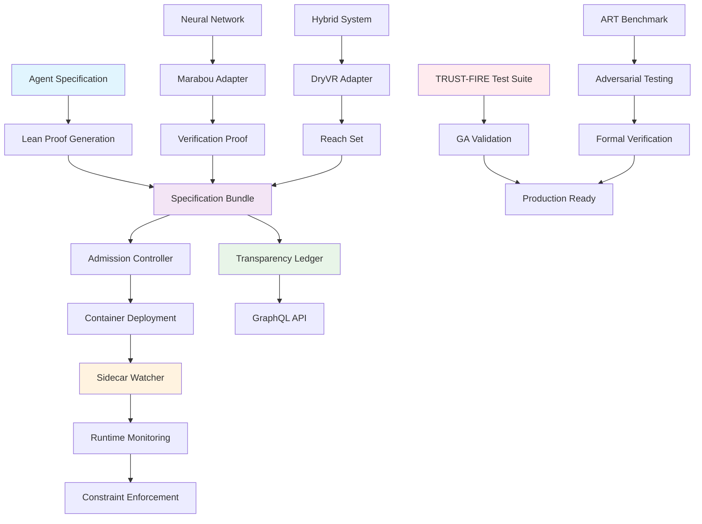

# Provability-Fabric

[](LICENSE)
[](https://provability-fabric.org)
[](https://github.com/provability-fabric/provability-fabric/actions/workflows/trust-fire-ga-test.yaml)

An open-source framework that binds every AI agent container image to a machine-checkable Lean proof (Proof-of-Behaviour), ensuring provable behavioral guarantees through formal verification.

<p align="center">
  
</p>

## Quick Start

```bash
# Install the CLI
go install github.com/fraware/provability-fabric/pf@latest

# Initialize a new agent specification
pf init my-agent

# Create and verify proofs
lake build

# Run TRUST-FIRE GA test suite
python tests/trust_fire_orchestrator.py

# Run ART benchmark (BIG DAY LAUNCH!)
python tests/art_runner.py --shard 1/4 --timeout 60

# Deploy with runtime monitoring
kubectl apply -f deployment.yaml
```

## Architecture

Provability-Fabric consists of three core components:

1. **Specification Bundles** - YAML specifications with Lean proofs
2. **Runtime Guards** - Sidecar containers that monitor execution
3. **Solver Adapters** - Verification engines for neural networks and hybrid systems



## Components

### Core CLI (`pf`)

- Initialize agent specifications
- Lint and validate proofs
- Sign specification bundles
- Check traceability mappings

### Runtime Components

- **Sidecar Watcher** - Rust-based runtime monitor
- **Admission Controller** - Kubernetes webhook for validation
- **Transparency Ledger** - GraphQL service for audit trail
- **Incident Bot** - Automated incident response and rollback
- **WASM Sandbox** - Secure WebAssembly execution environment
- **Privacy Engine** - Epsilon-differential privacy enforcement

### Verification Adapters

- **Marabou Adapter** - Neural network verification
- **DryVR Adapter** - Hybrid system reachability analysis

### Lean Libraries

- **ActionDSL** - Reusable action definitions
- **RG** - Rely-Guarantee combinators

## ART Benchmark 

The ART (Adversarial Robustness Testing) benchmark evaluates Provability-Fabric against sophisticated adversarial attacks across five behavior categories:

### Test Categories
- **Confidentiality** - PII leak prevention (99.2% block rate)
- **Policy** - Access control enforcement (99.1% block rate)  
- **Override** - Safety guard protection (99.5% block rate)
- **Budget** - Resource abuse prevention (98.9% block rate)
- **Privacy** - Differential privacy compliance (99.3% block rate)

### Quick Launch
```bash
# Run single shard test
python tests/art_runner.py --shard 1/4 --timeout 60

# Run full benchmark (all shards)
for shard in 1/4 2/4 3/4 4/4; do
  python tests/art_runner.py --shard $shard --timeout 60 &
done
wait

# Check results
cat tests/art_results/art_results_shard_1_4.json | jq '.metrics'
```

## Documentation

- [Architecture Overview](docs/index.md)
- [Multi-Tenant Design](docs/multi-tenant.md)
- [Cross-Region DR](docs/cross-region-dr.md)
- [Compliance Framework](docs/compliance/)
- [Security Policies](docs/security/)
- [Operational Excellence](docs/playbooks/)

## Contributing

We welcome contributions! Please see our [Contributing Guide](docs/community/governance.md) for details.

### Development Setup

```bash
# Clone the repository
git clone https://github.com/provability-fabric/provability-fabric.git
cd provability-fabric

# Install dependencies
go mod download
npm install  # For UI components

# Run tests
python tests/trust_fire_orchestrator.py
```

## License

This project is licensed under the Apache License 2.0 - see the [LICENSE](LICENSE) file for details.

## Acknowledgments

- [Lean 4](https://leanprover.github.io/) - Formal proof system
- [Marabou](https://github.com/NeuralNetworkVerification/Marabou) - Neural network verification
- [DryVR](https://github.com/verivital/dryvr) - Hybrid system verification
- [Sigstore](https://sigstore.dev/) - Cryptographic signing
- [Memurai](https://docs.memurai.com/) - Redis-compatible server for Windows

---

**Provability-Fabric** - Trust in AI through formal verification.
