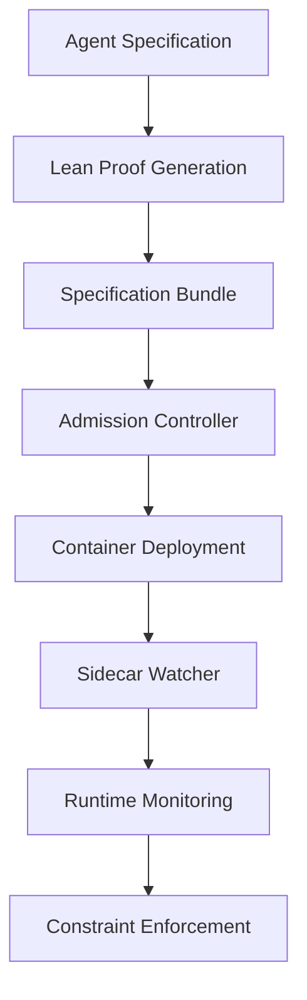

# Provability-Fabric

[](https://github.com/provability-fabric/provability-fabric/actions)
[](LICENSE)
[](https://provability-fabric.org)

An open-source framework that binds every AI agent container image to a machine-checkable Lean proof (Proof-of-Behaviour), ensuring provable behavioral guarantees through formal verification.

## 🚀 Quick Start

```bash
# Install the CLI
go install github.com/provability-fabric/pf@latest

# Initialize a new agent specification
pf init my-agent

# Create and verify proofs
lake build

# Deploy with runtime monitoring
kubectl apply -f deployment.yaml
```

## 📖 Documentation

- **[Documentation Site](https://provability-fabric.org)** - Complete guides and API reference
- **[Quickstart Guide](docs/quickstart.md)** - Get up and running in minutes
- **[Specification Format](docs/spec-bundles.md)** - Learn about YAML and Lean specifications
- **[Runtime Monitoring](docs/runtime.md)** - Understand sidecar watchers and admission controllers

## 🏗️ Architecture

Provability-Fabric consists of three core components:

1. **Specification Bundles** - YAML specifications with Lean proofs
2. **Runtime Guards** - Sidecar containers that monitor execution
3. **Solver Adapters** - Verification engines for neural networks and hybrid systems



## 🔧 Components

### Core CLI (`pf`)

- Initialize agent specifications
- Lint and validate proofs
- Sign specification bundles
- Check traceability mappings

### Runtime Components

- **Sidecar Watcher** - Rust-based runtime monitor
- **Admission Controller** - Kubernetes webhook for validation
- **Transparency Ledger** - GraphQL service for audit trail

### Verification Adapters

- **Marabou Adapter** - Neural network verification
- **DryVR Adapter** - Hybrid system reachability analysis

### Lean Libraries

- **ActionDSL** - Reusable action definitions
- **RG** - Rely-Guarantee combinators

## 🛡️ Security

- [Security Policy](SECURITY.md) - Vulnerability reporting and disclosure
- Cryptographic verification of all specifications
- Runtime enforcement of behavioral constraints
- Immutable audit trail of all deployments

## 🤝 Contributing

We welcome contributions! Please see our [Contributing Guide](CONTRIBUTING.md) for details.

### Development Setup

```bash
# Clone the repository
git clone https://github.com/provability-fabric/provability-fabric.git
cd provability-fabric

# Install dependencies
go mod download
npm install  # for ledger service
cargo build  # for sidecar watcher

# Run tests
go test ./...
npm test
cargo test
```

## 📄 License

This project is licensed under the Apache License 2.0 - see the [LICENSE](LICENSE) file for details.

## 🙏 Acknowledgments

- [Lean 4](https://leanprover.github.io/) - Formal proof system
- [Marabou](https://github.com/NeuralNetworkVerification/Marabou) - Neural network verification
- [DryVR](https://github.com/verivital/dryvr) - Hybrid system verification
- [Sigstore](https://sigstore.dev/) - Cryptographic signing

## 📞 Support

- [GitHub Issues](https://github.com/provability-fabric/provability-fabric/issues)
- [Discord Community](https://discord.gg/provability-fabric)
- [Documentation](https://provability-fabric.org)

---

**Provability-Fabric** - Trust in AI through formal verification.
