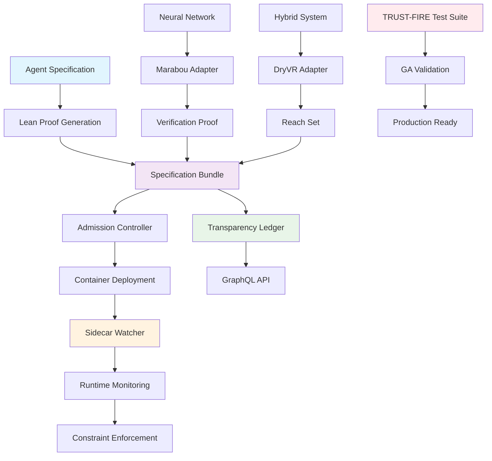

# Provability-Fabric

[](LICENSE)
[](https://provability-fabric.org)
[](https://github.com/provability-fabric/provability-fabric/actions/workflows/trust-fire-ga-test.yaml)

An open-source framework that binds every AI agent container image to a machine-checkable Lean proof (Proof-of-Behaviour), ensuring provable behavioral guarantees through formal verification.

<p align="center">
  
</p>

## Quick Start

```bash
# Install the CLI
go install github.com/provability-fabric/pf@latest

# Initialize a new agent specification
pf init my-agent

# Create and verify proofs
lake build

# Run TRUST-FIRE GA test suite
python tests/trust_fire_orchestrator.py

# Deploy with runtime monitoring
kubectl apply -f deployment.yaml
```

## Architecture

Provability-Fabric consists of three core components:

1. **Specification Bundles** - YAML specifications with Lean proofs
2. **Runtime Guards** - Sidecar containers that monitor execution
3. **Solver Adapters** - Verification engines for neural networks and hybrid systems



## Components

### Core CLI (`pf`)

- Initialize agent specifications
- Lint and validate proofs
- Sign specification bundles
- Check traceability mappings

### Runtime Components

- **Sidecar Watcher** - Rust-based runtime monitor
- **Admission Controller** - Kubernetes webhook for validation
- **Transparency Ledger** - GraphQL service for audit trail
- **Incident Bot** - Automated incident response and rollback
- **WASM Sandbox** - Secure WebAssembly execution environment
- **Privacy Engine** - Epsilon-differential privacy enforcement

### Verification Adapters

- **Marabou Adapter** - Neural network verification
- **DryVR Adapter** - Hybrid system reachability analysis

### Lean Libraries

- **ActionDSL** - Reusable action definitions
- **RG** - Rely-Guarantee combinators

## TRUST-FIRE Test Suite

Provability-Fabric includes a comprehensive GA test suite that validates every SLO, security guard, and rollback path:

### Test Phases

1. **Edge Traffic Surge** - High RPS load testing with cache validation
2. **Tenant Privacy Burn-Down** - Epsilon budget consumption and DSAR export
3. **Malicious Adapter Sandbox** - WASM security scanning and prohibited syscall detection
4. **Chaos + Rollback** - Fault injection and automated rollback testing
5. **Cold Start & Scale-to-Zero** - Performance and resource optimization
6. **Evidence & KPI Audit** - Compliance and metrics validation

### Running Tests

```bash
# Run complete TRUST-FIRE suite
python tests/trust_fire_orchestrator.py

# Run individual phases
python tests/privacy/privacy_burn_down.py --tenant-id acme-beta
python tests/security/malicious_adapter_test.py
python tests/chaos/chaos_rollback_test.py
```

## Production Features

### Security & Compliance

- **SLSA Level 3** - Supply chain security
- **SOC 2 Type II** - Compliance framework
- **Cross-Region DR** - Disaster recovery
- **RBAC** - Role-based access control
- **Network Policies** - Zero-trust networking

### Monitoring & Observability

- **Grafana Dashboards** - Real-time metrics
- **Prometheus** - Time-series monitoring
- **Jaeger** - Distributed tracing
- **Alertmanager** - Incident management

### CI/CD Pipeline

- **GitHub Actions** - Automated testing and deployment
- **Cross-Region Deployment** - Multi-region availability
- **Automated Rollbacks** - Incident response
- **Evidence Collection** - Compliance automation

## Documentation

- [Architecture Overview](docs/index.md)
- [Multi-Tenant Design](docs/multi-tenant.md)
- [Cross-Region DR](docs/cross-region-dr.md)
- [Compliance Framework](docs/compliance/)
- [Security Policies](docs/security/)
- [Operational Excellence](docs/playbooks/)

## Contributing

We welcome contributions! Please see our [Contributing Guide](docs/community/governance.md) for details.

### Development Setup

```bash
# Clone the repository
git clone https://github.com/provability-fabric/provability-fabric.git
cd provability-fabric

# Install dependencies
go mod download
npm install  # For UI components

# Run tests
python tests/trust_fire_orchestrator.py
```

## License

This project is licensed under the Apache License 2.0 - see the [LICENSE](LICENSE) file for details.

## Acknowledgments

- [Lean 4](https://leanprover.github.io/) - Formal proof system
- [Marabou](https://github.com/NeuralNetworkVerification/Marabou) - Neural network verification
- [DryVR](https://github.com/verivital/dryvr) - Hybrid system verification
- [Sigstore](https://sigstore.dev/) - Cryptographic signing
- [Memurai](https://docs.memurai.com/) - Redis-compatible server for Windows

---

**Provability-Fabric** - Trust in AI through formal verification.
