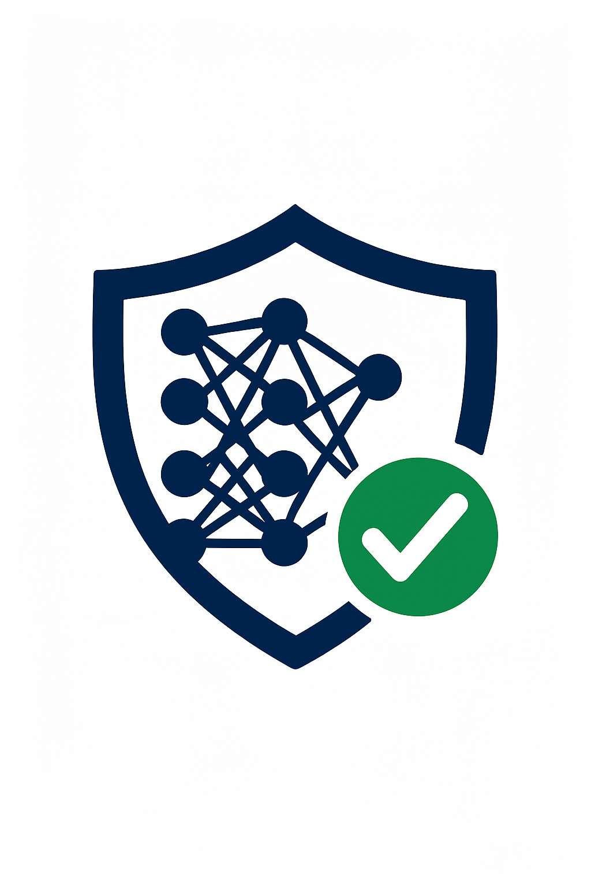
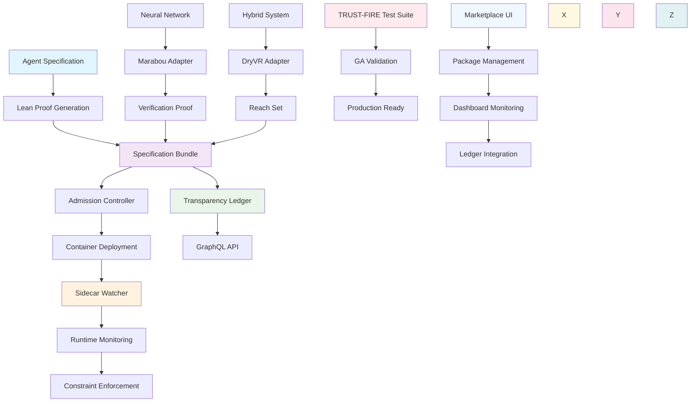

<p align="center">
  
</p>

# Provability Fabric

[](LICENSE)
[](https://provability-fabric.org)
[](https://github.com/SentinelOps-CI/provability-fabric)
[](.github/workflows/lean-morph.yml)

An open-source framework that enforces provable behavioral guarantees through formal verification, runtime security mechanisms, and comprehensive audit trails.

## Repository Structure

```
provability-fabric/
├── README.md                 # Project documentation
├── LICENSE                   # Apache 2.0 license
├── VERSION                   # Current version
├── Makefile                  # Build system
├── lakefile.lean            # Lean build configuration
├── lean-toolchain           # Lean version specification
├── .gitignore               # Version control exclusions
├── config/                  # Configuration files
│   ├── schemas/            # JSON schemas (e.g., aispec-schema.json)
│   └── specifications/     # Specification documents
├── scripts/                 # Utility scripts
│   └── setup/              # Infrastructure setup scripts
├── tests/                   # Test suites
│   ├── integration/        # Integration tests
│   ├── unit/               # Unit tests
│   ├── privacy/            # Privacy tests
│   ├── replay/             # Replay tests
│   └── debugging/          # Debugging tests
├── core/                    # Core framework
├── runtime/                 # Runtime components
├── bundles/                 # Agent bundles
├── tools/                   # Development tools
├── docs/                    # Documentation
└── [other directories...]
```

## Quick Start
## Standards & Replays

Adopt the ecosystem standards and end-to-end evidence loop:

- CERT-V1 (schema + verifiers): https://github.com/verifiable-ai-ci/CERT-V1
- TRACE-REPLAY-KIT (runner + oracles): https://github.com/verifiable-ai-ci/TRACE-REPLAY-KIT
- morph-lean-ci (sharded Lean): https://github.com/SentinelOps-CI/morph-lean-ci
- morph-replay-runner (branch-N replays): https://github.com/SentinelOps-CI/morph-replay-runner
- mcp-sidecar-demo (permissions/epochs/IFC): https://github.com/SentinelOps-CI/mcp-sidecar-demo

See `docs/standards.md`, `docs/Evidence.md`, and `docs/Replay.md` for usage.

### Option 1: Automated Installation (Recommended)

```bash
# Clone the repository
git clone https://github.com/provability-fabric.git

# Run the installation script
./scripts/install.sh           # For Linux/macOS
scripts/install.bat            # For Windows Command Prompt (RECOMMENDED for Windows)
# Note: Git Bash on Windows may have execution issues

# Test the installation
./scripts/test-new-user.sh     # For Linux/macOS
scripts/test-new-user.bat      # For Windows Command Prompt (RECOMMENDED for Windows)

# Troubleshoot Windows Git Bash issues (if needed)
bash scripts/windows-troubleshoot.sh  # For Windows Git Bash troubleshooting
```

### Option 2: Launch the Production Web Interface

The project includes a comprehensive web ecosystem with real-time capabilities, advanced search, and secure authentication:

```bash
# Quick launch all services (Recommended)
./launch-web-interfaces.bat     # Windows
./launch-web-interfaces.sh      # Linux/macOS

# Or launch services individually:

# 1. Start the Ledger API with WebSocket and Authentication
cd runtime/ledger && node minimal-server.js
# Available at: http://localhost:8080

# 2. Start the Console UI
cd console && npm install && npm start
# Available at: http://localhost:3000

# 4. Start the Documentation Site
mkdocs serve --dev-addr=127.0.0.1:8002
# Available at: http://127.0.0.1:8002

### Option 3: Manual Installation

```bash
# Clone the repository
git clone https://github.com/provability-fabric.git

# Build the CLI from source
cd core/cli/pf
go build -o pf .  # On Windows, output is pf.exe

# Add to PATH (Important for Windows users)
# Linux/macOS
export PATH=$PATH:$(pwd)

# Windows (Command Prompt) - RECOMMENDED
set PATH=%PATH%;%CD%

# Windows (PowerShell)
$env:PATH += ";$PWD"

# Go back to repository root
cd ../../..

# Initialize a new agent specification
./pf init my-agent           # Linux/macOS
pf.exe init my-agent         # Windows CMD or PowerShell (RECOMMENDED for Windows)

# Create and verify proofs (must be run from the correct directory)
cd spec-templates/v1/proofs
lake build                   # Requires Lean 4 to be installed
cd ../../../

# Run TRUST-FIRE GA test suite (must be run from repository root)
python tests/trust_fire_orchestrator.py

# Deploy with runtime monitoring (Kubernetes)
# Note: The deployment files are Helm templates and require proper setup
# For testing, you can use the inline deployments from the GitHub workflows:
kubectl apply -f - <<EOF
apiVersion: apps/v1
kind: Deployment
metadata:
  name: attestor
spec:
  replicas: 1
  selector:
    matchLabels:
      app: attestor
  template:
    metadata:
      labels:
        app: attestor
    spec:
      containers:
      - name: attestor
        image: provability-fabric/attestor:test
        ports:
        - containerPort: 8080
        env:
        - name: REDIS_URL
          value: "redis://redis-master:6379"
---
apiVersion: v1
kind: Service
metadata:
  name: attestor-service
spec:
  selector:
    app: attestor
  ports:
  - protocol: TCP
    port: 8080
    targetPort: 8080
EOF
```

## Prerequisites

Before running the installation, ensure you have:

- **Go 1.21+** - For building CLI tools
- **Python 3.8+** - For running tests and scripts
- **Node.js 18+** - For UI components (optional)
- **Lean 4** - For formal proofs (optional, see [Lean installation guide](https://leanprover.github.io/lean4/doc/quickstart.html))
- **kubectl** - For Kubernetes deployment (optional)
- **Rust** - For runtime components (optional)

**For Data Retention Manager:**

- **PostgreSQL** - For hot storage (7-day retention)
- **AWS S3** - For warm storage (compressed Parquet)
- **Google BigQuery** - For cold storage analytics
- **Python packages**: `psycopg2-binary`, `boto3`, `google-cloud-bigquery`, `pandas`, `pyarrow`, `pyyaml`

## Architecture

Provability-Fabric consists of six core components with comprehensive security and real-time capabilities:

1. **Specification Bundles** - YAML specifications with Lean proofs
2. **Runtime Guards** - Sidecar containers that monitor execution
3. **Solver Adapters** - Verification engines for neural networks and hybrid systems
4. **Marketplace UI** - React-based dashboard with advanced search and real-time updates
5. **WebSocket Real-Time System** - Live communication for monitoring and notifications
6. **Authentication & User Management** - JWT-based security with role-based access control

### Architecture


```mermaid
flowchart TD
    A[Agent Specification] --> B[Lean Proof Generation]
    B --> C[Specification Bundle]
    C --> D[Admission Controller]
    D --> E[Container Deployment]
    E --> F[Sidecar Watcher]
    F --> G[Runtime Monitoring]
    G --> H[Constraint Enforcement]

    I[Neural Network] --> J[Marabou Adapter]
    J --> K[Verification Proof]
    K --> C

    L[Hybrid System] --> M[DryVR Adapter]
    M --> N[Reach Set]
    N --> C

    C --> O[Transparency Ledger]
    O --> P[GraphQL API]

    Q[TRUST-FIRE Test Suite] --> R[GA Validation]
    R --> S[Production Ready]

    T[Marketplace UI] --> U[Package Management]
    U --> V[Dashboard Monitoring]
    V --> W[Ledger Integration]

    style A fill:#e1f5fe
    style C fill:#f3e5f5
    style F fill:#fff3e0
    style O fill:#e8f5e8
    style Q fill:#ffebee
    style T fill:#f0f8ff
    style X fill:#fff8e1
    style Y fill:#fce4ec
    style Z fill:#e0f2f1
```

## Contributing

We welcome contributions! Please see our [Contributing Guide](docs/community/governance.md) for details.

### Development Setup

```bash
# Clone the repository
git clone https://github.com/provability-fabric.git

# Build CLI tools from source
cd core/cli/pf && go build -o pf.exe . && cd ../..
cd cmd/specdoc && go build -o specdoc.exe . && cd ../..

# Install Python dependencies for testing (if requirements.txt files exist)
if [ -f "tests/integration/requirements.txt" ]; then pip install -r tests/integration/requirements.txt; fi
if [ -f "tests/proof-fuzz/requirements.txt" ]; then pip install -r tests/proof-fuzz/requirements.txt; fi
if [ -f "tools/compliance/requirements.txt" ]; then pip install -r tools/compliance/requirements.txt; fi
if [ -f "tools/insure/requirements.txt" ]; then pip install -r tools/insure/requirements.txt; fi
if [ -f "tools/proofbot/requirements.txt" ]; then pip install -r tools/proofbot/requirements.txt; fi

# Install Node.js dependencies for Console UI
cd console && npm install && cd ..

# Start the Console UI development server (optional)
cd console && npm start
# The UI will be available at http://localhost:3000

# Run tests (from repository root)
python tests/trust_fire_orchestrator.py
```

## Troubleshooting

### Common Issues

1. **`pf` command not found**: Make sure you've built the CLI and added it to your PATH
2. **`lake build` fails**: Ensure you're in the `spec-templates/v1/proofs` directory and have Lean 4 installed
3. **Python script errors**: Make sure you're running scripts from the repository root
4. **`deployment.yaml` not found**: The deployment files are Helm templates, not plain Kubernetes YAML. Use the inline examples from the README or set up Helm properly
5. **Kubernetes deployment fails**: Requires a running Kubernetes cluster (Docker Desktop, Minikube, or cloud cluster)
6. **Git Bash path issues**: Use forward slashes (`/`) instead of backslashes (`\`) in Git Bash
7. **Windows file removal issues**: Use the updated scripts with Windows-compatible file removal methods
8. **"Device or resource busy" errors**: Close any applications accessing the files and try again
9. **UI module resolution errors**: Ensure TypeScript configuration is properly set up in `marketplace/ui/tsconfig.json`
10. **Heroicons import errors**: Use the correct icon names (e.g., `CubeIcon` instead of `PackageIcon`, `ArrowDownTrayIcon` instead of `DownloadIcon`)

### Platform-Specific Notes

- **Windows**: Use `pf.exe` instead of `pf` and ensure proper PATH setup. **Use Windows Command Prompt instead of Git Bash for running installation scripts**
- **Git Bash/WSL**: Use `bash scripts/install.sh` for installation and forward slashes for paths
- **Lean 4**: May require network access for dependency downloads
- **Kubernetes**: Install Docker Desktop with Kubernetes enabled, or use Minikube for local development

### Windows Git Bash Path Issues

If you encounter path-related errors in Git Bash on Windows:

1. **Use forward slashes**: Always use `/` instead of `\` in paths

   ```bash
   # Correct
   bash scripts/install.sh
   cd core/cli/pf

   # Incorrect
   bash scripts\install.sh
   cd core\cli\pf
   ```

2. **File removal issues**: If you get "Device or resource busy" errors:

   - Close any file explorers or text editors accessing the files
   - Use the updated scripts which handle Windows file removal properly
   - Try running the script again after closing applications

3. **Command interpretation**: Git Bash interprets backslashes as escape characters:

   ```bash
   # Correct
   export PATH=$PATH:$(pwd)/core/cli/pf

   # Incorrect
   export PATH=$PATH:$(pwd)\core\cli\pf
   ```

4. **Troubleshooting**: If you're still having issues, run the troubleshooting script:
   ```bash
   bash scripts/windows-troubleshoot.sh
   ```

### Lean 4 Setup

For Lean 4 formal proofs:

1. **Install Lean 4**: Follow the [official installation guide](https://leanprover.github.io/lean4/doc/quickstart.html)
2. **Build proofs**: Run `cd spec-templates/v1/proofs && lake build`
3. **Network issues**: If you encounter certificate errors, try using a VPN or check your network settings

### Git Bash Specific Issues

If you're using Git Bash on Windows and encounter issues:

1. **Path separators**: Use forward slashes (`/`) instead of backslashes (`\`)
2. **Command execution**: Use `bash scripts/install.sh` instead of `scripts\install.bat`
3. **File permissions**: Some file operations may require different permissions in Git Bash
4. **Line endings**: Ensure files use Unix line endings (LF) instead of Windows line endings (CRLF)
5. **"Device or resource busy" errors**: Close any applications (file explorers, editors) that might be accessing the files
6. **File removal issues**: The scripts now use Windows-compatible file removal methods
7. **Backslash interpretation**: Git Bash interprets backslashes as escape characters, so always use forward slashes

## License

This project is licensed under the Apache License 2.0 - see the [LICENSE](LICENSE) file for details.

## Acknowledgments

- [Lean 4](https://leanprover.github.io/) - Formal proof system
- [Marabou](https://github.com/NeuralNetworkVerification/Marabou) - Neural network verification
- [DryVR](https://github.com/verivital/dryvr) - Hybrid system verification
- [Sigstore](https://sigstore.dev/) - Cryptographic signing
- [Memurai](https://docs.memurai.com/) - Redis-compatible server for Windows

---

**Provability-Fabric** - Trust in AI through formal verification and comprehensive security mechanisms with advanced multi-channel security and performance guarantees.
