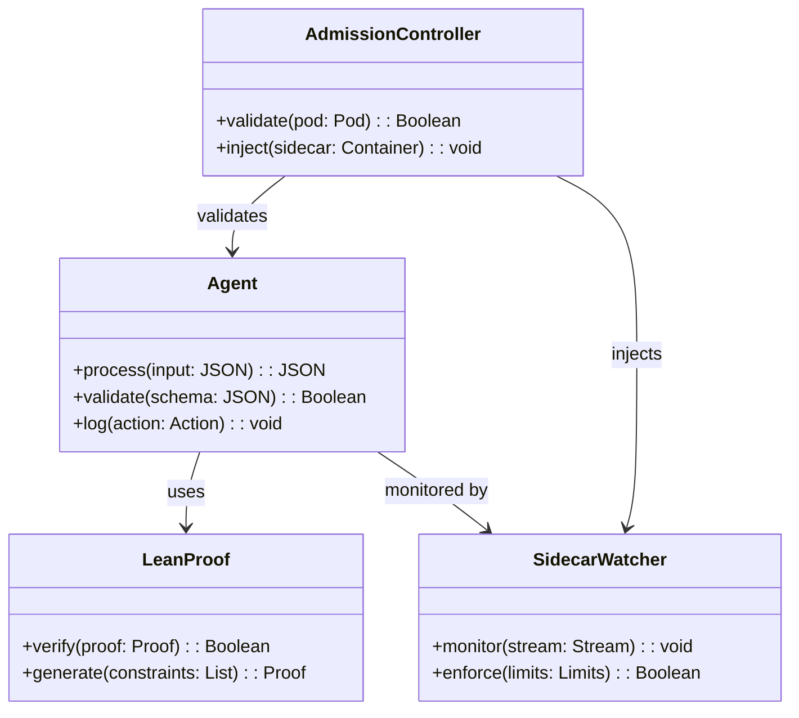

<!--
SPDX-License-Identifier: Apache-2.0
Copyright 2025 Provability-Fabric Contributors
Licensed under the Apache License, Version 2.0 (the "License");
you may not use this file except in compliance with the License.
You may obtain a copy of the License at

    http://www.apache.org/licenses/LICENSE-2.0

Unless required by applicable law or agreed to in writing, software
distributed under the License is distributed on an "AS IS" BASIS,
WITHOUT WARRANTIES OR CONDITIONS OF ANY KIND, either express or implied.
See the License for the specific language governing permissions and
limitations under the License.
-->

# AI Agent Specification Template

## 1. Title, Purpose & Scope

This specification defines the requirements for an AI agent that operates within the Provability-Fabric framework. The agent shall demonstrate provable behavioral guarantees through formal verification, ensuring compliance with specified constraints while maintaining operational efficiency. The scope encompasses agent initialization, runtime behavior monitoring, and proof-of-behavior validation.

## 2. Stakeholders & Authorities

| Name              | Role                         | Signatory? |
| ----------------- | ---------------------------- | ---------- |
| System Architect  | Technical Design Authority   | Y          |
| Security Officer  | Compliance & Risk Management | Y          |
| Operations Lead   | Deployment & Monitoring      | N          |
| Quality Assurance | Testing & Validation         | N          |
| Legal Counsel     | Regulatory Compliance        | Y          |

## 3. Glossary

**Agent Container** – A Docker image containing the AI agent implementation and its runtime dependencies.

**Proof-of-Behaviour** – A machine-checkable Lean proof that validates agent behavior against specified constraints.

**Specification Bundle** – A collection of YAML specifications, Lean proofs, and metadata that define agent behavior.

**Rely-Guarantee** – A formal method for reasoning about concurrent systems using rely and guarantee conditions.

**Behavioral Contract** – A formal specification of agent behavior expressed in mathematical terms.

## 4. Context & Constraints

- **Legal**: Agent must comply with data protection regulations and maintain audit trails for all decisions.
- **Performance**: Agent response time must not exceed 500ms for 95% of requests under normal load.
- **Security**: All agent communications must be encrypted and authenticated using TLS 1.3.
- **Operations**: Agent must support graceful shutdown and health check endpoints for monitoring.

## 5. Functional Requirements

| ID       | Requirement                                                                       | Rationale                                            | Metric                       | Owner            | Priority |
| -------- | --------------------------------------------------------------------------------- | ---------------------------------------------------- | ---------------------------- | ---------------- | -------- |
| REQ-0001 | The agent SHALL validate all inputs against JSON schema before processing.        | Prevent injection attacks and ensure data integrity. | 100% input validation rate   | Security Officer | High     |
| REQ-0002 | The agent SHALL log all actions with timestamps and context for audit purposes.   | Enable compliance auditing and debugging.            | Complete action log coverage | Operations Lead  | Medium   |
| REQ-0003 | The agent SHALL enforce budget limits and spam score thresholds during operation. | Prevent resource abuse and maintain service quality. | Zero budget violations       | System Architect | High     |

## 6. Non-Functional Requirements

| ID       | Requirement                                                        | Rationale                          | Metric              | Owner           | Priority |
| -------- | ------------------------------------------------------------------ | ---------------------------------- | ------------------- | --------------- | -------- |
| NFR-0001 | Agent response time shall not exceed 500ms for 95% of requests.    | Ensure responsive user experience. | P95 latency ≤ 500ms | Operations Lead | High     |
| NFR-0002 | Agent shall maintain 99.9% uptime excluding scheduled maintenance. | Ensure service reliability.        | Uptime ≥ 99.9%      | Operations Lead | Medium   |

## 7. Acceptance Criteria

| ID      | Criterion                                                              | Links to Requirements |
| ------- | ---------------------------------------------------------------------- | --------------------- |
| AC-0001 | All agent inputs are validated against JSON schema with 100% coverage. | REQ-0001              |
| AC-0002 | Complete action logs are generated with timestamps and context.        | REQ-0002              |
| AC-0003 | Budget limits are enforced with zero violations during testing.        | REQ-0003, NFR-0001    |
| AC-0004 | Agent responds within 500ms for 95% of test requests.                  | NFR-0001              |

## 8. Out-of-Scope & Assumptions

**Out-of-Scope:**

- Integration with external third-party services not specified in requirements
- Custom UI development or user interface components
- Legacy system compatibility or migration support

**Assumptions:**

- Agent will run in a containerized environment with sufficient resources
- Network connectivity to required services will be available
- Lean proof verification tools will be accessible during deployment

## 9. Dependencies & Interfaces

## 10. Traceability Matrix

See spec.yaml trace section for complete requirement-to-acceptance-criteria mapping.

## 11. Revision History

| Version | Date       | Author           | Summary                        |
| ------- | ---------- | ---------------- | ------------------------------ |
| 0.1.0   | 2025-01-15 | System Architect | Initial specification template |

