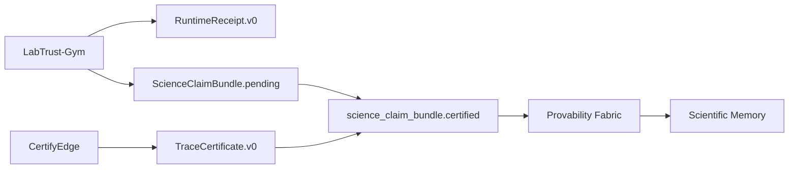

# Proof-carrying lab workflow (v0.1)

This guide describes the end-to-end Proof-Carrying Science demo for hospital QC release simulation. It is not clinical validation or production medical certification.

## Flow



1. **LabTrust-Gym** runs the `qc-release` demo, exports trace and runtime receipt, and builds a pending science claim bundle.
2. **CertifyEdge** emits `TraceCertificate.v0` for the trace.
3. LabTrust attaches the certificate to produce `science_claim_bundle.certified.json`.
4. **Provability Fabric** verifies consistency and signs an importable result.
5. **Scientific Memory** imports the signed bundle and renders the claim with guarantee-type separation.

## Provability Fabric role

Provability Fabric is the admission gate for PCS bundles:

- It does not simulate LabTrust or perform temporal trace checking.
- It checks internal consistency, provenance fields, certificate status, and trace-hash alignment.
- It emits `VerificationResult.v0` and, when requested, `SignedScienceClaimBundle.v0`.

```bash
./pf verify science-claim tests/pcs/fixtures/labtrust/science_claim_bundle.certified.json
./pf sign science-claim tests/pcs/fixtures/labtrust/science_claim_bundle.certified.json --out signed_science_claim_bundle.json
./pf inspect science-claim signed_science_claim_bundle.json --strict
./pf inspect science-claim tests/pcs/fixtures/labtrust/signed_science_claim_bundle.json --reverify
```

## Scientific Memory handoff

Scientific Memory imports `signed_science_claim_bundle.json` and reads:

- `science_claim_bundle`
- `verification_result` (including `checks[].details.reason_code` on failures)
- `signature_or_digest` on the signed wrapper

No in-process Provability Fabric installation is required in Scientific Memory for import.

## Release gates

```bash
make test-pcs
make validate-pcs-fixtures
make validate-pcs-schema-diff
just pcs-schema-diff
```

Or run the standalone validator:

```bash
cd tools/pcs-validate && go run . --fixtures ../../tests/pcs
```

## Canonical vocabulary

Artifact schemas and status enums are defined in [pcs-core](https://github.com/SentinelOps-CI/pcs-core). Provability Fabric consumes those artifacts; it does not define competing types.

## PCS v0.1 clean-checkout chain

Full cross-repo release gate (LabTrust-Gym, CertifyEdge, Provability Fabric, Scientific Memory): [pcs-v01-clean-chain.md](pcs-v01-clean-chain.md).

```bash
export PCS_DETERMINISTIC=1
just pcs-v01-clean-chain
```

## Related documentation

- [Science claim verification](science-claim-verification.md)
- [PCS v0.1 clean-checkout chain](pcs-v01-clean-chain.md)
