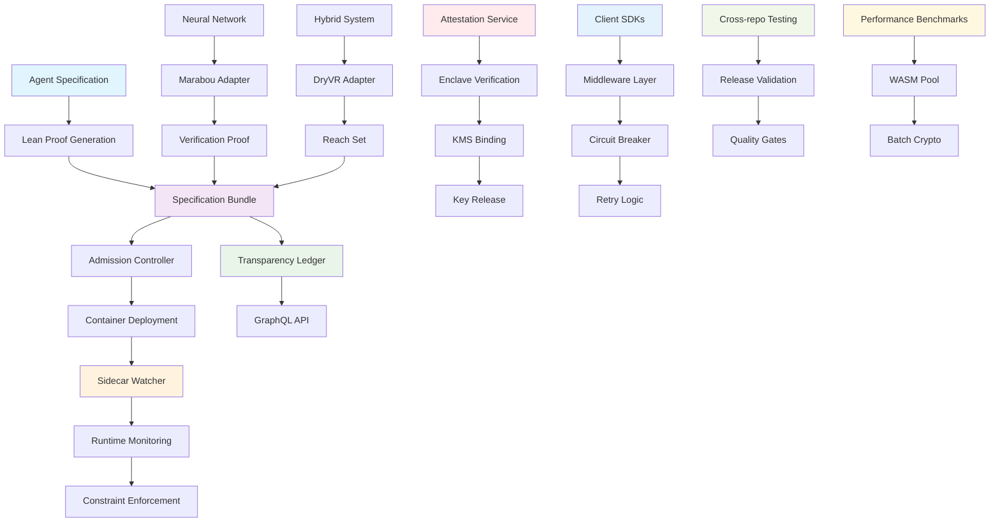

# Provability-Fabric

An open-source framework that binds every AI agent container image to a machine-checkable Lean proof (Proof-of-Behaviour), ensuring provable behavioral guarantees through formal verification.

## Overview

Provability-Fabric provides a comprehensive toolkit for creating AI agents with mathematically verifiable behavior. The framework combines specification-driven development with runtime enforcement to ensure agents operate within defined constraints. By binding container images to formal proofs, Provability-Fabric enables trust in AI systems through cryptographic verification rather than blind faith.

The framework consists of three core components: specification bundles that define agent behavior in YAML and Lean, runtime guards that monitor execution in real-time, and solver adapters that verify neural network properties. This creates a complete pipeline from formal specification to deployed, verified agents.

Key features include automatic sidecar injection for runtime monitoring, admission controllers that validate proofs before deployment, and a transparency ledger that maintains an immutable record of all agent specifications and their verification status. The framework supports multiple verification engines including Marabou for neural networks and DryVR for hybrid systems.

Provability-Fabric is designed for production use with comprehensive CI/CD integration, security policies, and community governance. It enables organizations to deploy AI agents with confidence, knowing their behavior is mathematically guaranteed to remain within specified bounds.

## Architecture



## Quick Start

For a comprehensive introduction to Provability-Fabric, start with our [Getting Started Guide](getting-started.md).

### Core Services
```bash
# Initialize a new agent specification
pf init my-agent

# Create and verify proofs
lake build

# Deploy with runtime monitoring
kubectl apply -f deployment.yaml
```

### Client SDKs
```bash
# TypeScript/Node.js
npm install @provability-fabric/core-sdk-typescript

# Go
go get github.com/provability-fabric/core/sdk/go

# Rust
cargo add provability-fabric-core-sdk-rust
```

### Performance Testing
```bash
# Run performance benchmarks
cargo bench

# WASM worker pool testing
cargo test --package wasm-sandbox

# Batch signature verification
cargo test --package crypto
```

## Documentation

- **[Getting Started](getting-started.md)** - Quick start guide and basic concepts
- **[Architecture Overview](architecture.md)** - System architecture and design principles
- **[Developer Guide](developer-guide.md)** - Development setup and contribution guidelines
- **[API Reference](api-reference.md)** - Complete API documentation
- **[Examples](examples.md)** - Practical examples and use cases
- **[Testing Guide](testing-guide.md)** - Testing strategies and best practices
- **[Deployment Guide](deployment-guide.md)** - Production deployment instructions
- **[CLI Reference](cli-reference.md)** - Command-line interface reference
- **[Configuration](configuration.md)** - Configuration options and management
- **[Security](security/README.md)** - Security architecture and best practices
- **[Runbooks](runbooks/README.md)** - Operational procedures and troubleshooting
- **[Glossary](glossary.md)** - Terms and definitions

## License

Apache 2.0 License - see [LICENSE](../LICENSE) for details.
