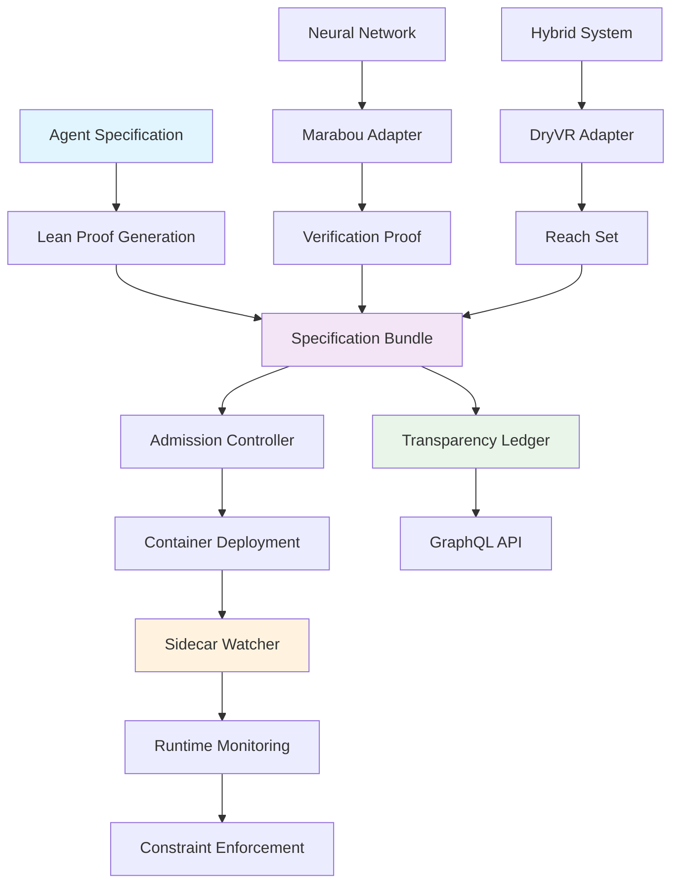

# Provability-Fabric

An open-source framework that binds every AI agent container image to a machine-checkable Lean proof (Proof-of-Behaviour), ensuring provable behavioral guarantees through formal verification.

## Overview

Provability-Fabric provides a comprehensive toolkit for creating AI agents with mathematically verifiable behavior. The framework combines specification-driven development with runtime enforcement to ensure agents operate within defined constraints. By binding container images to formal proofs, Provability-Fabric enables trust in AI systems through cryptographic verification rather than blind faith.

The framework consists of three core components: specification bundles that define agent behavior in YAML and Lean, runtime guards that monitor execution in real-time, and solver adapters that verify neural network properties. This creates a complete pipeline from formal specification to deployed, verified agents.

Key features include automatic sidecar injection for runtime monitoring, admission controllers that validate proofs before deployment, and a transparency ledger that maintains an immutable record of all agent specifications and their verification status. The framework supports multiple verification engines including Marabou for neural networks and DryVR for hybrid systems.

Provability-Fabric is designed for production use with comprehensive CI/CD integration, security policies, and community governance. It enables organizations to deploy AI agents with confidence, knowing their behavior is mathematically guaranteed to remain within specified bounds.

## Architecture



## Quick Start

```bash
# Initialize a new agent specification
pf init my-agent

# Create and verify proofs
lake build

# Deploy with runtime monitoring
kubectl apply -f deployment.yaml
```

## Documentation

- **[Quickstart](quickstart.md)** - Get up and running in minutes
- **[Spec Bundles](spec-bundles.md)** - Learn about specification formats
- **[Lean Proofs](lean.md)** - Understand formal verification
- **[Runtime](runtime.md)** - Runtime monitoring and enforcement
- **[API Reference](api.md)** - Complete API documentation

## Community

- [GitHub](https://github.com/provability-fabric/provability-fabric)
- [Discord](https://discord.gg/provability-fabric)
- [Twitter](https://twitter.com/provabilityfab)

## License

Apache 2.0 License - see [LICENSE](../LICENSE) for details.
