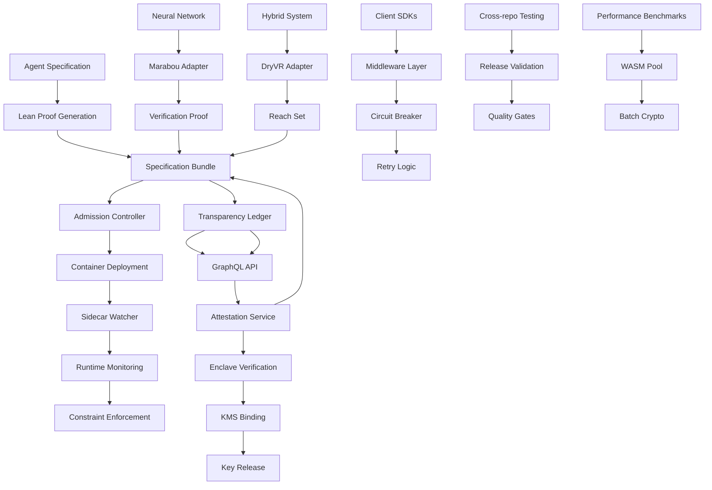

# Provability-Fabric

An open-source framework that binds every AI agent container image to a machine-checkable Lean proof (Proof-of-Behaviour), ensuring provable behavioral guarantees through formal verification.

## Overview

Provability-Fabric provides a comprehensive toolkit for creating AI agents with mathematically verifiable behavior. The framework combines specification-driven development with runtime enforcement to ensure agents operate within defined constraints. By binding container images to formal proofs, Provability-Fabric enables trust in AI systems through cryptographic verification rather than blind faith.

The framework consists of six core components: specification bundles that define agent behavior in YAML and Lean, runtime guards that monitor execution in real-time, solver adapters that verify neural network properties, a modern web-based marketplace with advanced search capabilities, real-time WebSocket communication for live monitoring, and comprehensive authentication and user management.

## Architecture


```mermaid
flowchart TD
    A[Agent Specification] --> B[Lean Proof Generation]
    B --> C[Specification Bundle]
    C --> D[Admission Controller]
    D --> E[Container Deployment]
    E --> F[Sidecar Watcher]
    F --> G[Runtime Monitoring]
    G --> H[Constraint Enforcement]

    I[Neural Network] --> J[Marabou Adapter]
    J --> K[Verification Proof]
    K --> C

    L[Hybrid System] --> M[DryVR Adapter]
    M --> N[Reach Set]
    N --> C

    O[GPU Neural Network] --> P[α-β-CROWN Adapter]
    P --> Q[GPU Verification Proof]
    Q --> C

    C --> O[Transparency Ledger]
    O --> P[GraphQL API]

    %% New PF-CORE Components
    Q[Attestation Service] --> R[Enclave Verification]
    R --> S[KMS Binding]
    S --> T[Key Release]

    U[Client SDKs] --> V[Middleware Layer]
    V --> W[Circuit Breaker]
    W --> X[Retry Logic]

    Y[Cross-repo Testing] --> Z[Release Validation]
    Z --> AA[Quality Gates]

    BB[Performance Benchmarks] --> CC[WASM Pool]
    CC --> DD[Batch Crypto]
```

## Quick Start

For a comprehensive introduction to Provability-Fabric, start with our [Getting Started Guide](guides/getting-started.md).

### Core Services
```bash
# Initialize a new agent specification
pf init my-agent

# Create and verify proofs
lake build

# Deploy with runtime monitoring
kubectl apply -f deployment.yaml
```

### Client SDKs
```bash
# TypeScript/Node.js
npm install @provability-fabric/core-sdk-typescript

# Go
go get github.com/provability-fabric/core/sdk/go

# Rust
cargo add provability-fabric-core-sdk-rust
```

### Performance Testing
```bash
# Run performance benchmarks
cargo bench

# WASM sandbox tests
cargo test -p wasm-sandbox

# All workspace tests (from repo root)
cargo test --workspace
```

## Documentation

### Core
- **[Getting Started](guides/getting-started.md)** - Quick start guide and basic concepts
- **[Architecture Overview](architecture/overview.md)** - System architecture and design principles
- **[Developer Guide](guides/developer-guide.md)** - Development setup and contribution guidelines
- **[API Reference](reference/api-reference.md)** - Complete API documentation
- **[Examples](guides/examples.md)** - Practical examples and use cases

### Integrations
- **[MCP Integration](integrations/mcp/integration.md)** - Complete MCP implementation guide
- **[MCP Quick Reference](integrations/mcp/quick-reference.md)** - Developer quick reference for MCP APIs
- **[MCP Migration](integrations/mcp/migration-guide.md)** - Migration guide for existing MCP implementations

### Deployment & Operations
- **[Deployment Guide](guides/deployment-guide.md)** - Production deployment instructions
- **[Testing Guide](guides/testing-guide.md)** - Testing strategies and best practices
- **[Security](security/README.md)** - Security architecture, supply-chain automation, and best practices
- **[Runbooks](runbooks/README.md)** - Operational procedures and troubleshooting

### Reference
- **[Evidence & CERTs](evidence/overview.md)** - Where evidence and CERTs live and how to validate them
- **[Replay](evidence/replay.md)** - Replay and TRACE-REPLAY-KIT
- **[CLI Reference](reference/cli-reference.md)** - Command-line interface reference
- **[CI Reference](reference/ci-reference.md)** - Main `ci.yml`, reusable Rust/Lean/Node jobs, supply-chain gates (Dependency review, cargo-deny, actionlint, SBOM, Scorecard), PF CI / TRUST-FIRE, Bench SWE-bench
- **[Configuration](reference/configuration.md)** - Configuration options and management
- **[Versioning](reference/versioning.md)** - Platform version and crate/package versions
- **[Proof-Carrying Science (PCS)](pcs/README.md)** - Verify, sign, release chain, admission benchmarks
- **[Glossary](glossary.md)** - Terms and definitions
- **[Standards](specs/standards.md)** - Framework standards and specifications

**Bench / SWE-bench:** See `bench/swebench/README.md`, `experiments/README.md`, and `experiments/exp-step2-lite-smoke/commands.md` for entry points, experiment flow, compare gates, and verification. The SWE-bench pipeline is modular: `bench/swebench/run_config.py` (`RunConfig`, `build_argument_parser`), `runner.py` (`main()` validates config then calls `_execute_run`), `runner_core.py` (`run_swebench(config)` for programmatic runs), plus `workspace_manager.py`, `instance_processor.py`, `evidence_writer.py`, `predictions_writer.py`, `summary_writer.py`, `cost_reporter.py`, and `engines/` (OpenHands, mock, adapters). **LLM provider resolution** (OpenAI / Anthropic / Prime Intellect keys, base URL fallbacks, Prime model prefixing) is centralized in **`bench/swebench/provider_env.py`** and shared with `engines/openhands_engine.py`, `experiments/scripts/ensure_openhands_config.py`, and runner `env.json` diagnostics. **Verification checklist and pytest command list:** [internal/swebench-stabilization-regression-matrix.md](internal/swebench-stabilization-regression-matrix.md).

**Bench pipeline status (exp-step2-lite-smoke):** For the current golden baseline/PF run IDs, harness/compare outputs, and publish bundle location, see `experiments/exp-step2-lite-smoke/run-ids.md` and (when present) `runs/exp-step2-lite-smoke/publish/`. The root `README.md` repository structure line may record a snapshot date for the last verified green cycle.

**Contributor tracking:** Placeholder inventory and v1 burn-down are under [internal/placeholders](internal/placeholders/inventory.md).

For the current repository layout (Rust workspace, optional crates, toolchain), see the [repository README](../README.md) "Rust workspace" and "Repository Structure" sections.

## License

Apache 2.0 License - see [LICENSE](../LICENSE) for details.
