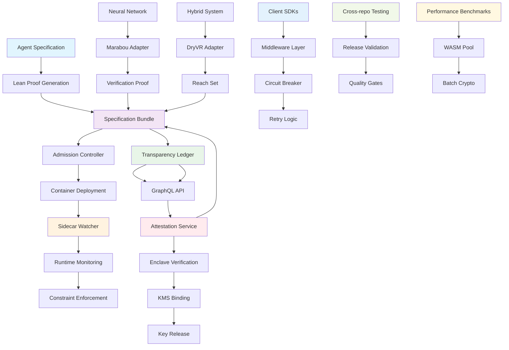

# Provability-Fabric

An open-source framework that binds every AI agent container image to a machine-checkable Lean proof (Proof-of-Behaviour), ensuring provable behavioral guarantees through formal verification.

## Overview

Provability-Fabric provides a comprehensive toolkit for creating AI agents with mathematically verifiable behavior. The framework combines specification-driven development with runtime enforcement to ensure agents operate within defined constraints. By binding container images to formal proofs, Provability-Fabric enables trust in AI systems through cryptographic verification rather than blind faith.

The framework consists of six core components: specification bundles that define agent behavior in YAML and Lean, runtime guards that monitor execution in real-time, solver adapters that verify neural network properties, a modern web-based marketplace with advanced search capabilities, real-time WebSocket communication for live monitoring, and comprehensive authentication and user management.

## Architecture


```mermaid
flowchart TD
    A[Agent Specification] --> B[Lean Proof Generation]
    B --> C[Specification Bundle]
    C --> D[Admission Controller]
    D --> E[Container Deployment]
    E --> F[Sidecar Watcher]
    F --> G[Runtime Monitoring]
    G --> H[Constraint Enforcement]

    I[Neural Network] --> J[Marabou Adapter]
    J --> K[Verification Proof]
    K --> C

    L[Hybrid System] --> M[DryVR Adapter]
    M --> N[Reach Set]
    N --> C

    O[GPU Neural Network] --> P[α-β-CROWN Adapter]
    P --> Q[GPU Verification Proof]
    Q --> C

    C --> O[Transparency Ledger]
    O --> P[GraphQL API]

    %% New PF-CORE Components
    Q[Attestation Service] --> R[Enclave Verification]
    R --> S[KMS Binding]
    S --> T[Key Release]

    U[Client SDKs] --> V[Middleware Layer]
    V --> W[Circuit Breaker]
    W --> X[Retry Logic]

    Y[Cross-repo Testing] --> Z[Release Validation]
    Z --> AA[Quality Gates]

    BB[Performance Benchmarks] --> CC[WASM Pool]
    CC --> DD[Batch Crypto]

    style A fill:#e1f5fe
    style C fill:#f3e5f5
    style F fill:#fff3e0
    style O fill:#e8f5e8
    style Q fill:#ffebee
    style U fill:#e3f2fd
    style Y fill:#f1f8e9
    style BB fill:#fff8e1
```

## Quick Start

For a comprehensive introduction to Provability-Fabric, start with our [Getting Started Guide](getting-started.md).

### Core Services
```bash
# Initialize a new agent specification
pf init my-agent

# Create and verify proofs
lake build

# Deploy with runtime monitoring
kubectl apply -f deployment.yaml
```

### Client SDKs
```bash
# TypeScript/Node.js
npm install @provability-fabric/core-sdk-typescript

# Go
go get github.com/provability-fabric/core/sdk/go

# Rust
cargo add provability-fabric-core-sdk-rust
```

### Performance Testing
```bash
# Run performance benchmarks
cargo bench

# WASM worker pool testing
cargo test --package wasm-sandbox

# Batch signature verification
cargo test --package crypto
```

## Documentation

### Core Documentation
- **[Getting Started](getting-started.md)** - Quick start guide and basic concepts
- **[Architecture Overview](architecture.md)** - System architecture and design principles
- **[Developer Guide](developer-guide.md)** - Development setup and contribution guidelines
- **[API Reference](api-reference.md)** - Complete API documentation
- **[Examples](examples.md)** - Practical examples and use cases

### New Features (2025)
- **[Model Context Protocol (MCP) Integration](mcp-integration.md)** - Complete MCP implementation guide
- **[MCP Quick Reference](mcp-quick-reference.md)** - Developer quick reference for MCP APIs
- **[Real-Time Communication](features/real-time-communication.md)** - WebSocket system for live updates
- **[Advanced Search](features/advanced-search.md)** - Intelligent package discovery with fuzzy search
- **[Authentication & User Management](features/authentication.md)** - JWT-based security and RBAC

### Deployment & Operations
- **[Production Deployment](deployment/production-deployment.md)** - Complete production setup guide
- **[Testing Guide](testing-guide.md)** - Testing strategies and best practices
- **[Security](security/README.md)** - Security architecture and best practices
- **[Runbooks](runbooks/README.md)** - Operational procedures and troubleshooting

### Reference
- **[CLI Reference](cli-reference.md)** - Command-line interface reference
- **[Configuration](configuration.md)** - Configuration options and management
- **[Glossary](glossary.md)** - Terms and definitions

## License

Apache 2.0 License - see [LICENSE](../LICENSE) for details.
