# Decision Path Overview

This document describes the end-to-end decision path for the Provability Fabric system, from initial observation through to final safety case generation.

## Decision Flow Diagram

```mermaid
graph TD
    A[🔍 Observe Request] --> B[📋 Retrieve Access Receipt]
    B --> C[📝 Plan with DSL]
    C --> D[🔒 Kernel Checks]
    D --> E[🤝 Broker Decision]
    E --> F[📜 Generate Egress Certificate]
    F --> G[📦 Safety Case Bundle]
    
    subgraph "Kernel Checks"
        D1[Capability Match]
        D2[Receipt Presence]
        D3[Label Flow + Refinements]
    end
    
    subgraph "Broker Components"
        E1[Trusted Channel]
        E2[Untrusted Channel]
        E3[Evidence Collection]
    end
    
    subgraph "Safety Artifacts"
        G1[Session Bundle]
        G2[Evidence Chain]
        G3[Non-Interference Verdict]
    end
    
    D --> D1
    D --> D2
    D --> D3
    E --> E1
    E --> E2
    E --> E3
    F --> G1
    F --> G2
    F --> G3
```

## Decision Path Steps

### 1. Observe Request
- System receives incoming request with metadata
- Extracts user context, resource identifiers, and operation type
- Logs initial observation for audit trail

### 2. Retrieve Access Receipt
- Looks up existing Access Receipt for the requested resource
- Validates receipt authenticity and expiration
- Ensures receipt covers the specific partition being accessed

### 3. Plan with DSL
- Generates execution plan using the Plan DSL
- Specifies allowed operations and constraints
- Includes receipt references and capability requirements

### 4. Kernel Checks
Three critical checks are performed:

#### Capability Match
- Verifies `caps_required ⊆ subject.caps`
- Ensures user has sufficient permissions for requested operation

#### Receipt Presence
- Confirms every read operation has a verified Access Receipt
- Validates receipt covers the correct data partition

#### Label Flow + Refinements
- Validates input/output labels satisfy security rules
- Checks budget and epsilon values are within acceptable limits

### 5. Broker Decision
- Routes request through appropriate channel (trusted/untrusted)
- Collects evidence from all decision points
- Applies policy rules and constraints

### 6. Generate Egress Certificate
- Creates certificate with 8 required fields including NI verdict
- Includes evidence chain and confidence scores
- Signs with cryptographic proof of compliance

### 7. Safety Case Bundle
- Compiles complete session artifacts
- Includes all evidence, receipts, and certificates
- Provides audit trail for compliance verification

## Key Properties

- **Non-Interference**: Untrusted channels never elevated to instruction level
- **Evidence Chain**: Every decision point generates verifiable evidence
- **Receipt Integrity**: All data access requires valid, unexpired receipts
- **Capability Enforcement**: Strict capability checking prevents privilege escalation
- **Audit Trail**: Complete session bundles enable post-hoc verification

## Integration Points

- **Plan DSL**: Defines allowed operations and constraints
- **Egress Certificates**: Provide cryptographic proof of compliance
- **Safety Cases**: Bundle all artifacts for audit and compliance
- **SLO Monitoring**: Tracks performance and reliability metrics 