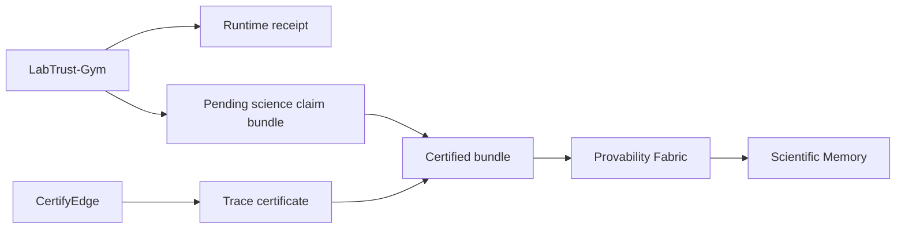

# PCS quickstart

This walkthrough verifies and signs a LabTrust conformance bundle. It does not require sibling repos beyond optional pcs-core for schema checks.

## One-command demo

From the repository root:

```bash
make demo-pcs
```

This runs:

1. `pf verify science-claim` on the certified bundle
2. `pf sign science-claim` to a demo signed output
3. `pf inspect science-claim --strict` on the signed bundle
4. `pf inspect science-claim --reverify` on the LabTrust-export signed fixture

## Manual commands

```bash
./pf verify science-claim tests/pcs/fixtures/labtrust/science_claim_bundle.certified.json
./pf sign science-claim tests/pcs/fixtures/labtrust/science_claim_bundle.certified.json \
  --out tests/pcs/signed_science_claim_bundle.demo.json
./pf inspect science-claim tests/pcs/signed_science_claim_bundle.demo.json --strict
```

Or with Go directly:

```bash
go -C core/cli/pf run . verify science-claim \
  tests/pcs/fixtures/labtrust/science_claim_bundle.certified.json
```

## End-to-end flow (overview)



1. LabTrust runs a demo and exports trace, runtime receipt, and a pending bundle.
2. CertifyEdge emits a trace certificate.
3. LabTrust attaches the certificate to produce `science_claim_bundle.certified.json`.
4. Provability Fabric verifies consistency and signs an importable result.
5. Scientific Memory imports the signed bundle.

Provability Fabric does not simulate LabTrust or run temporal checking. It checks internal consistency, provenance, certificate status, and trace-hash alignment.

## Release-mode smoke test

Frozen release fixtures are under `tests/pcs/fixtures/labtrust-release/`:

```bash
make demo-pcs-release
```

For strict release admission (handoff, registry, admission profile, formal artifacts), see [Verification](verification.md).

## Next steps

- [Verification](verification.md) — release mode, 17 checks, explain commands
- [Clean checkout chain](clean-checkout-chain.md) — full cross-repo release
- [Admission benchmarks](admission-benchmarks.md) — measure admission controller quality
- [Fixtures](fixtures.md) — regenerate frozen release evidence
