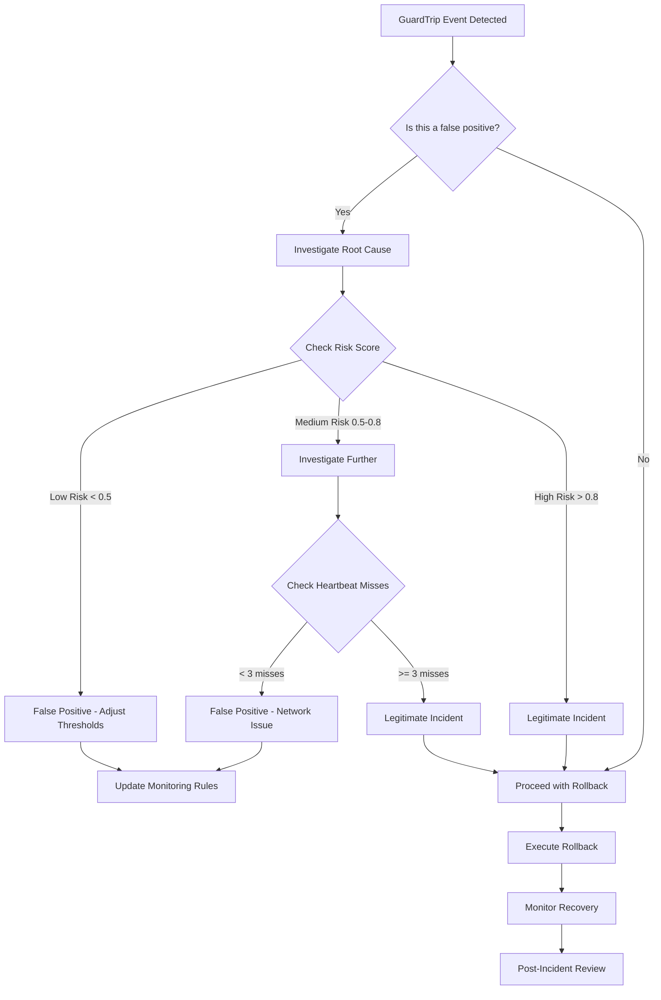

# Incident Response Playbook

This playbook provides a structured approach to handling incidents in Provability-Fabric, with specific focus on determining if GuardTrip events are false positives.

## Incident Response Triage Tree



## Step-by-Step Triage Process

### Step 1: Initial Assessment

**Questions to Ask:**

- What is the risk score?
- How many heartbeat misses occurred?
- Is this a known tenant/capsule?
- Are there any recent deployments?

**Commands:**

```bash
# Get incident details
kubectl logs deployment/incident-bot -n monitoring --tail=50 | grep "GuardTrip"

# Check current system status
kubectl get pods -A
kubectl get helmreleases -A

# Check recent deployments
flux get helmreleases
```

### Step 2: Risk Score Analysis

| Risk Score Range | Action                | Likelihood of False Positive |
| ---------------- | --------------------- | ---------------------------- |
| 0.0 - 0.3        | Investigate           | High                         |
| 0.3 - 0.5        | Monitor               | Medium                       |
| 0.5 - 0.8        | Investigate           | Low                          |
| 0.8 - 1.0        | Proceed with rollback | Very Low                     |

**Investigation Commands:**

```bash
# Check capsule details
kubectl get capsules --all-namespaces | grep <capsule-hash>

# Check tenant activity
kubectl logs deployment/ledger -n default | grep <tenant-id>

# Check recent events
kubectl get events --sort-by=.metadata.creationTimestamp | tail -20
```

### Step 3: Heartbeat Analysis

**Thresholds:**

- 1-2 misses: Likely network issue
- 3-4 misses: Suspicious activity
- 5+ misses: High probability of compromise

**Investigation:**

```bash
# Check network connectivity
kubectl exec deployment/attestor -n monitoring -- ping <capsule-endpoint>

# Check attestor logs
kubectl logs deployment/attestor -n monitoring --tail=100

# Check sidecar watcher logs
kubectl logs deployment/sidecar-watcher -n monitoring --tail=100
```

### Step 4: Context Analysis

**Check for:**

- Recent deployments
- Known maintenance windows
- Similar incidents
- Tenant behavior patterns

**Commands:**

```bash
# Check deployment history
helm history provability-fabric -n flux-system

# Check for similar incidents
kubectl get rollbacks --sort-by=.metadata.creationTimestamp

# Check tenant patterns
kubectl logs deployment/ledger -n default | grep <tenant-id> | tail -50
```

## False Positive Scenarios

### Scenario 1: Network Connectivity Issues

**Symptoms:**

- Low risk score (< 0.5)
- Heartbeat misses due to network
- Affects multiple capsules

**Actions:**

```bash
# Pause incident-bot temporarily
kubectl scale deployment incident-bot -n monitoring --replicas=0

# Investigate network
kubectl get networkpolicies -A
kubectl get endpoints -A

# Resume after network fix
kubectl scale deployment incident-bot -n monitoring --replicas=1
```

### Scenario 2: Maintenance Window

**Symptoms:**

- Planned maintenance in progress
- Multiple services affected
- Known deployment in progress

**Actions:**

```bash
# Check maintenance status
kubectl get configmap maintenance-status -n monitoring

# Temporarily disable automation
kubectl patch deployment incident-bot -n monitoring -p '{"spec":{"template":{"spec":{"containers":[{"name":"incident-bot","env":[{"name":"MAINTENANCE_MODE","value":"true"}]}]}}}}'
```

### Scenario 3: Threshold Tuning

**Symptoms:**

- Repeated false positives
- Risk scores just above threshold
- No actual security issues

**Actions:**

```bash
# Adjust thresholds temporarily
kubectl patch deployment incident-bot -n monitoring -p '{"spec":{"template":{"spec":{"containers":[{"name":"incident-bot","env":[{"name":"RISK_SCORE_THRESHOLD","value":"0.9"}]}]}}}}'

# Monitor for improvement
kubectl logs deployment/incident-bot -n monitoring -f
```

## Legitimate Incident Response

### Step 1: Immediate Actions

```bash
# Verify incident details
kubectl logs deployment/incident-bot -n monitoring | grep "Rollback decision"

# Check if rollback was triggered
kubectl get rollbacks

# Monitor rollback progress
kubectl get rollbacks -w
```

### Step 2: Containment

```bash
# Isolate affected capsule if possible
kubectl patch deployment <capsule-deployment> -p '{"spec":{"replicas":0}}'

# Check for lateral movement
kubectl get pods -A | grep <tenant-id>
kubectl get networkpolicies -A
```

### Step 3: Investigation

```bash
# Collect evidence
kubectl logs deployment/sidecar-watcher -n monitoring > incident-logs.txt
kubectl logs deployment/attestor -n monitoring >> incident-logs.txt

# Check for data exfiltration
kubectl exec deployment/ledger -n default -- psql -c "SELECT * FROM usage_events WHERE tenant_id = '<tenant-id>' ORDER BY ts DESC LIMIT 100;"
```

## Post-Incident Actions

### Step 1: Documentation

```bash
# Create incident report
cat > incident-report-$(date +%Y%m%d-%H%M%S).md << EOF
# Incident Report

**Date:** $(date)
**Capsule Hash:** <capsule-hash>
**Tenant ID:** <tenant-id>
**Risk Score:** <risk-score>
**Heartbeat Misses:** <misses>

## Timeline
- $(date): Incident detected
- $(date): Rollback initiated
- $(date): Recovery completed

## Root Cause
[Describe root cause]

## Lessons Learned
[Document lessons learned]

## Action Items
- [ ] Update monitoring rules
- [ ] Improve detection logic
- [ ] Update runbooks
EOF
```

### Step 2: Process Improvement

```bash
# Update thresholds if needed
kubectl patch deployment incident-bot -n monitoring -p '{"spec":{"template":{"spec":{"containers":[{"name":"incident-bot","env":[{"name":"RISK_SCORE_THRESHOLD","value":"0.85"}]}]}}}}'

# Add new monitoring rules
kubectl apply -f new-monitoring-rules.yaml
```

### Step 3: Communication

```bash
# Send incident summary to stakeholders
curl -X POST -H "Content-type: application/json" \
  --data '{"text":"🚨 Incident resolved - see incident report for details"}' \
  $SLACK_WEBHOOK_URL
```

## Monitoring and Alerting

### Key Metrics to Monitor

```bash
# Check incident-bot metrics
kubectl port-forward deployment/incident-bot 3000:3000 -n monitoring &
curl http://localhost:3000/metrics | grep incident_bot

# Check rollback metrics
kubectl port-forward deployment/rollback-controller 8080:8080 -n flux-system &
curl http://localhost:8080/metrics
```

### Alerting Rules

```yaml
# Prometheus alerting rules
groups:
  - name: incident-response
    rules:
      - alert: HighRollbackRate
        expr: rate(incident_bot_rollbacks_total[5m]) > 0.1
        for: 2m
        labels:
          severity: warning
        annotations:
          summary: "High rollback rate detected"

      - alert: RollbackLatencyHigh
        expr: histogram_quantile(0.95, rate(incident_bot_decision_latency_seconds_bucket[5m])) > 30
        for: 5m
        labels:
          severity: critical
        annotations:
          summary: "Rollback decision latency is high"
```

## Emergency Contacts

| Role                | Contact   | Escalation Time |
| ------------------- | --------- | --------------- |
| On-Call Engineer    | [Contact] | Immediate       |
| SRE Lead            | [Contact] | 15 minutes      |
| Security Team       | [Contact] | 30 minutes      |
| Engineering Manager | [Contact] | 1 hour          |

## Related Documentation

- [Rollback Runbook](../runbooks/rollback.md)
- [Automated Incident Response](../architecture/incident-response.md)
- [Security Incident Response](../security/incident-response.md)
- [Monitoring and Alerting](../monitoring/alerting.md)
